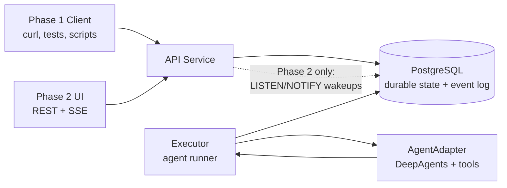
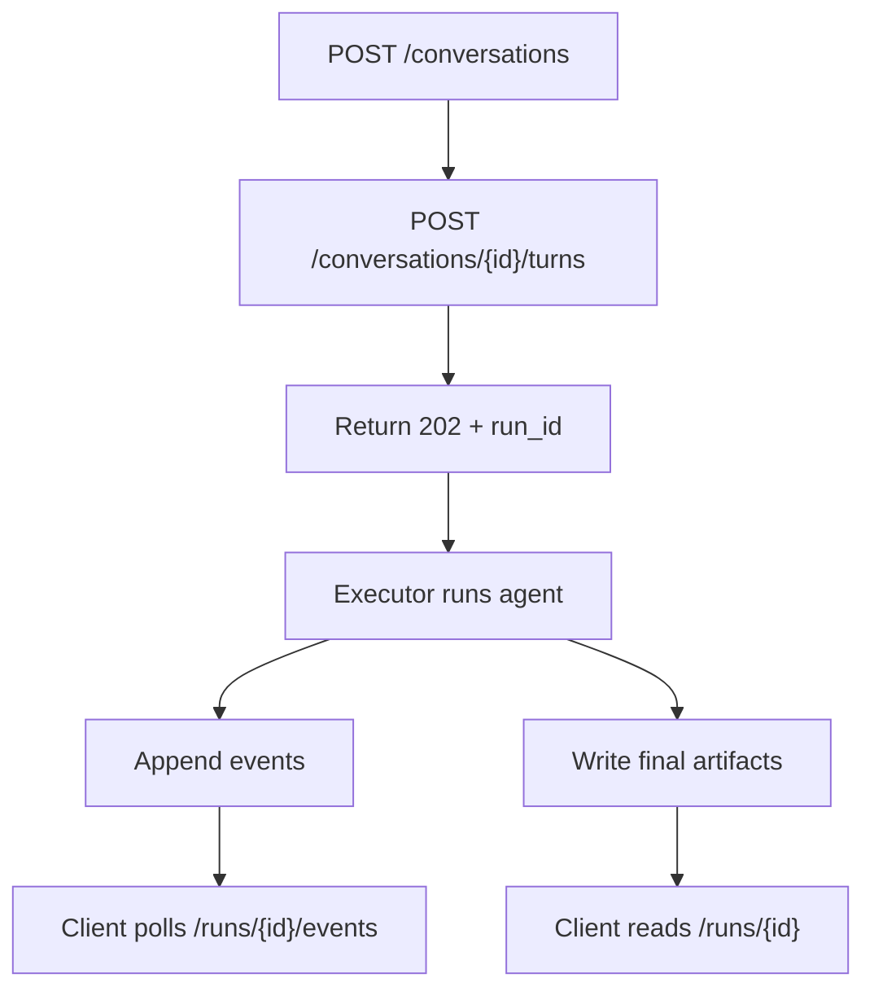
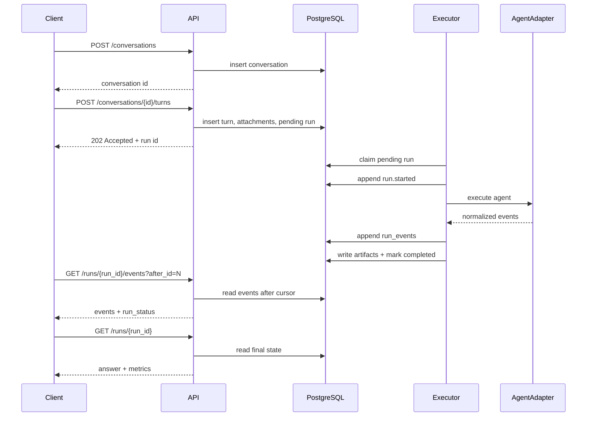
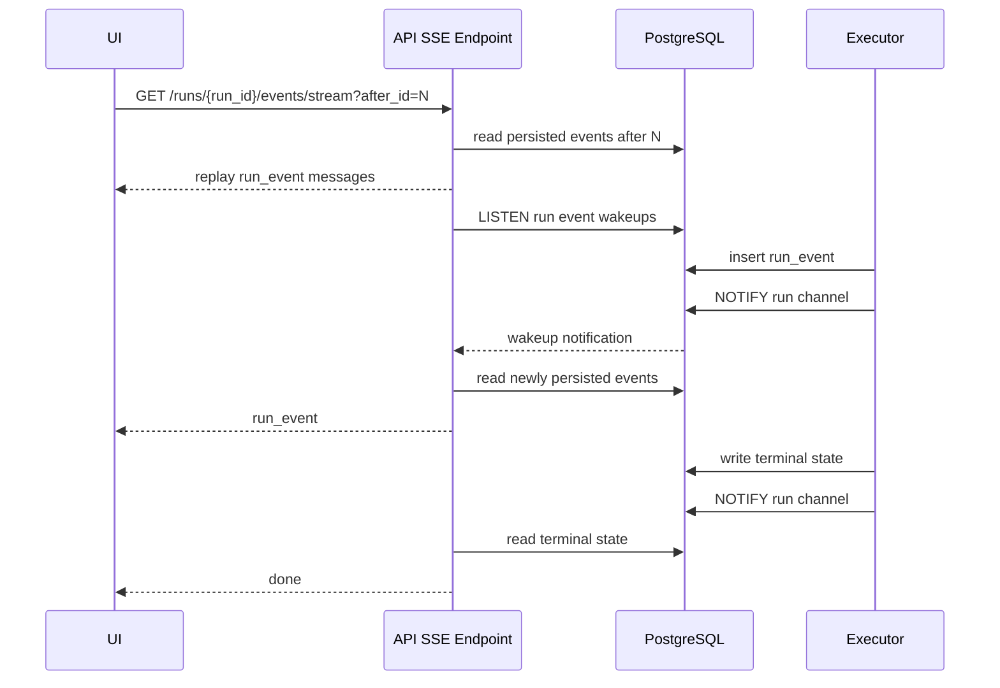
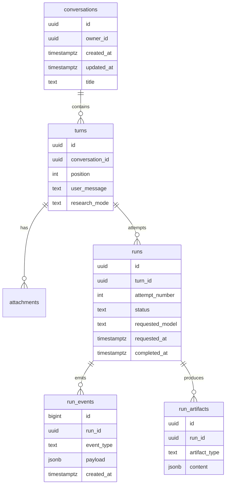
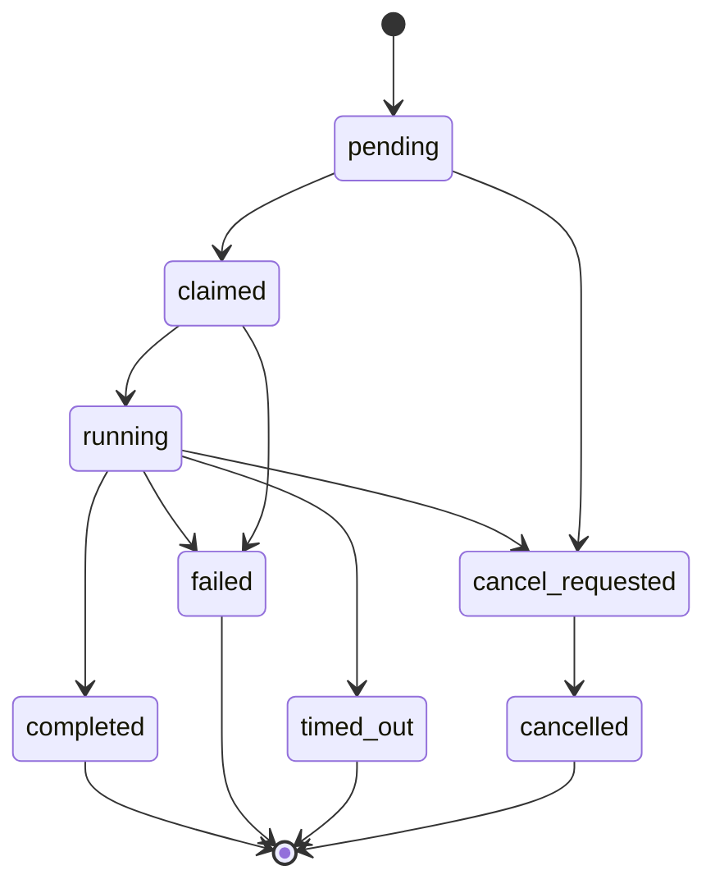
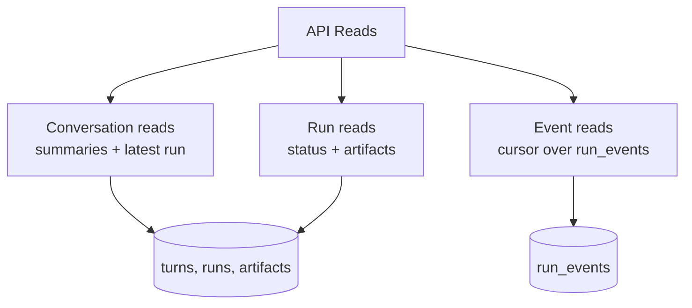

# CODEX 5.5 Revised Plan

## Purpose

This document reconciles the Codex and Claude API-first rewrite plans into one revised implementation plan.

The revised architecture keeps the core direction shared by both plans:

1. execution is primary
2. delivery is a projection
3. the event log is the source of truth
4. phase 1 ships with API-only behavior
5. phase 2 adds UI and SSE as consumers of the same event model

The main design correction in this version is that phase 1 does not need SSE at all. Phase 1 exposes durable execution through REST and JSON event polling. Phase 2 adds SSE by tailing the same event table, ideally with PostgreSQL `LISTEN/NOTIFY`, not with in-memory subscriber queues.

## How To Read This Plan

The plan is intentionally organized from wide to narrow:

1. system shape
2. phase 1 and phase 2 flows
3. domain concepts
4. event model
5. API surface
6. executor behavior
7. implementation sequence

The most important idea is simple: clients create work, the executor performs work, and every observable step is persisted as an event before any client sees it.

## High-Level Shape

At the highest level, this is not a chat UI with a backend. It is an execution system with optional clients.



Responsibilities stay deliberately small:

- Clients submit turns and read state.
- API validates requests, writes intent, and serves reads.
- Executor claims runs and writes events.
- PostgreSQL is the durable coordination point.
- AgentAdapter contains external library behavior.

## Keep It Simple Rules

These rules should guide implementation whenever there is a tempting more general design:

1. Build phase 1 without a frontend.
2. Build phase 1 without SSE.
3. Use PostgreSQL as the only coordination dependency at first.
4. Use one event table as the trace source of truth.
5. Use `run_events.id` as the cursor.
6. Allow one active run per conversation in phase 1.
7. Keep the executor in-process only if the code clearly preserves the future option of moving it out.
8. Prefer explicit SQL read queries over premature read-model tables.
9. Add artifacts only for terminal outputs that make reads simpler.
10. Do not add Redis, Celery, WebSockets, vector memory, or multi-user billing in the first rewrite pass.

## Minimum Viable Phase 1

The smallest useful version is:

1. create a conversation
2. create a turn
3. create one pending run for that turn
4. execute the run in the background
5. persist typed events to `run_events`
6. poll events by cursor
7. read final answer and metrics after completion

Anything outside that path should be treated as phase 1 hardening or phase 2.

Required in the first pass:

- Alembic schema
- settings validation
- stub agent adapter for tests
- real agent adapter after the run lifecycle works
- `GET /runs/{id}/events`
- `GET /runs/{id}`
- startup handling for active runs

Allowed to defer:

- SSE
- browser UI
- generated TypeScript types
- distributed worker process
- lease-based recovery
- event batching
- advanced admin analytics
- conversation summarization

## Minimal Phase 1 Request Loop



This is the core acceptance path. The rewrite should not move to phase 2 until this loop is reliable and covered by integration tests.

## Zoom Level 1: System Phases

Phase 1 proves that the execution system works without a UI.



Phase 2 adds live delivery without changing execution.



## Zoom Level 2: Durable Domain

The domain has five durable concepts.



The key relationship is `turns -> runs`: a user submission is stable, while execution attempts can be retried.

## Zoom Level 3: Run Lifecycle

Runs have a constrained lifecycle. The API can request cancellation, but the executor owns terminal status.



Phase 1 can mark active runs failed on process restart. Lease-based recovery can come later.

## Zoom Level 4: Read Paths

There are three read shapes. They should stay separate.



Conversation reads do not include full event history. Event reads do not reconstruct final answers. Run reads do not return an unbounded timeline.

## Executive Decision Summary

### Decisions adopted from the Codex plan

1. Keep `conversation`, `turn`, `run`, `event`, and `artifact` as distinct domain concepts.
2. Model `run` as an execution attempt for a `turn`, so retries do not mutate history.
3. Use one stable event envelope for historical JSON reads and SSE delivery.
4. Isolate `deepagents` behind an `AgentAdapter`.
5. Generate frontend types from OpenAPI before phase 2.
6. Add auth, migrations, validation, and observability early.

### Decisions adopted from the Claude plan

1. Phase 1 is API-only and has no UI or SSE requirement.
2. Phase 1 clients follow progress by polling an event endpoint with a cursor.
3. Phase 2 SSE is an upgrade to the same event read path.
4. No in-memory subscriber queues.
5. Event cursor is DB-generated.
6. Conversation detail does not include full event history.
7. No sidebar polling in phase 2.
8. Startup fails on missing required secrets.

### Revised decisions

1. Keep a separate `runs` table instead of collapsing runs into turns.
2. Use `run_events.id` as the global cursor instead of a per-run `sequence` column.
3. Scope event queries by `run_id` and cursor by global event id.
4. Store final answers as run artifacts and expose the latest completed answer through conversation reads.
5. Phase 1 executor may be in-process, but it must communicate through the database only.
6. Phase 2 SSE tails the database-backed event log and wakes via PostgreSQL `LISTEN/NOTIFY`.

## Core Architecture

### Principle

The HTTP request creates durable intent. The executor owns execution. Events are persisted before clients see them. Clients can disconnect without changing execution behavior.

### Runtime roles

1. `API service`
   Accepts commands, exposes reads, validates auth, and serves event history. In phase 2 it also serves SSE.

2. `Executor`
   Claims pending runs, invokes the agent, writes events, writes artifacts, and transitions run status.

3. `PostgreSQL`
   Stores conversations, turns, runs, attachments, artifacts, and run events. In phase 2 it can also wake SSE streams through `LISTEN/NOTIFY`.

4. `Clients`
   Phase 1 clients are scripts, tests, curl, and external integrations. Phase 2 adds the web UI.

### Phase 1 flow

```text
Client creates conversation
Client posts turn
API stores turn, attachments, and run
API returns run id immediately
Executor claims run
Executor writes run_events as work progresses
Client polls GET /runs/{run_id}/events?after_id=N
Client fetches GET /runs/{run_id} for final answer and metrics
```

### Phase 2 flow

```text
Client posts turn
API returns run id immediately
UI opens EventSource to /runs/{run_id}/events/stream?after_id=N
SSE endpoint replays persisted events after N
SSE endpoint tails new persisted events
Executor uses pg_notify after event inserts
SSE closes after terminal run state
UI fetches final run state
```

## Domain Model

## `conversations`

Represents a durable thread.

Recommended columns:

- `id UUID PRIMARY KEY`
- `owner_id UUID NULL`
- `created_at TIMESTAMPTZ NOT NULL`
- `updated_at TIMESTAMPTZ NOT NULL`
- `archived_at TIMESTAMPTZ NULL`
- `title TEXT NULL`
- `metadata JSONB NOT NULL DEFAULT '{}'`

Notes:

- `title` may be user-provided or derived from the first turn.
- If auth is deferred for local-only development, keep `owner_id` nullable but design queries so scoping can be added cleanly.

## `turns`

Represents one user submission in a conversation.

Recommended columns:

- `id UUID PRIMARY KEY`
- `conversation_id UUID NOT NULL REFERENCES conversations(id)`
- `position INTEGER NOT NULL`
- `user_message TEXT NOT NULL`
- `research_mode TEXT NOT NULL`
- `created_at TIMESTAMPTZ NOT NULL`
- `metadata JSONB NOT NULL DEFAULT '{}'`

Constraints and indexes:

- `UNIQUE (conversation_id, position)`
- `INDEX (conversation_id, position)`

Notes:

- A turn does not own execution state.
- A turn can have multiple runs over time if retried.
- One active run per conversation is the phase 1 default.

## `attachments`

Represents text attachments submitted with a turn.

Recommended columns:

- `id UUID PRIMARY KEY`
- `turn_id UUID NOT NULL REFERENCES turns(id)`
- `position INTEGER NOT NULL`
- `name TEXT NOT NULL`
- `mime_type TEXT NOT NULL`
- `size_bytes INTEGER NOT NULL`
- `sha256 TEXT NOT NULL`
- `content TEXT NOT NULL`
- `created_at TIMESTAMPTZ NOT NULL`

Constraints and indexes:

- `UNIQUE (turn_id, position)`
- `INDEX (turn_id, position)`

## `runs`

Represents one execution attempt for a turn.

Recommended columns:

- `id UUID PRIMARY KEY`
- `conversation_id UUID NOT NULL REFERENCES conversations(id)`
- `turn_id UUID NOT NULL REFERENCES turns(id)`
- `attempt_number INTEGER NOT NULL`
- `status TEXT NOT NULL`
- `requested_model TEXT NOT NULL`
- `requested_research_mode TEXT NOT NULL`
- `requested_at TIMESTAMPTZ NOT NULL`
- `claimed_at TIMESTAMPTZ NULL`
- `started_at TIMESTAMPTZ NULL`
- `completed_at TIMESTAMPTZ NULL`
- `executor_owner TEXT NULL`
- `executor_lease_expires_at TIMESTAMPTZ NULL`
- `error_code TEXT NULL`
- `error_message TEXT NULL`
- `cancel_requested_at TIMESTAMPTZ NULL`
- `cancellation_reason TEXT NULL`
- `metadata JSONB NOT NULL DEFAULT '{}'`

Constraints and indexes:

- `UNIQUE (turn_id, attempt_number)`
- `INDEX (status, requested_at)`
- `INDEX (conversation_id, requested_at DESC)`
- `INDEX (turn_id, attempt_number DESC)`

Allowed statuses:

- `pending`
- `claimed`
- `running`
- `completed`
- `failed`
- `cancel_requested`
- `cancelled`
- `timed_out`

Recommended transition graph:

```text
pending -> claimed -> running -> completed
                            -> failed
                            -> cancel_requested -> cancelled
                            -> timed_out
pending -> cancel_requested -> cancelled
claimed -> failed
```

## `run_events`

Append-only canonical event log.

Recommended columns:

- `id BIGSERIAL PRIMARY KEY`
- `run_id UUID NOT NULL REFERENCES runs(id)`
- `event_type TEXT NOT NULL`
- `payload JSONB NOT NULL DEFAULT '{}'`
- `schema_version INTEGER NOT NULL DEFAULT 1`
- `created_at TIMESTAMPTZ NOT NULL DEFAULT now()`

Indexes:

- `INDEX (run_id, id)`
- `INDEX (created_at DESC)`
- optional `INDEX (event_type)` for admin/debug tooling

Important decision:

- Use `id` as the cursor. Do not add application-generated `sequence`.
- Event reads use `WHERE run_id = $1 AND id > $2 ORDER BY id`.
- The event id is global, monotonic, DB-generated, and safe under concurrency.

## `run_artifacts`

Stores derived terminal outputs.

Recommended columns:

- `id UUID PRIMARY KEY`
- `run_id UUID NOT NULL REFERENCES runs(id)`
- `artifact_type TEXT NOT NULL`
- `content JSONB NOT NULL`
- `created_at TIMESTAMPTZ NOT NULL`

Artifact types:

- `final_answer`
- `metrics_summary`
- `agent_summary`

Constraints and indexes:

- `UNIQUE (run_id, artifact_type)`
- `INDEX (run_id)`

## Event Model

### Envelope

Every persisted event and every streamed event uses the same shape:

```json
{
  "id": 143,
  "run_id": "run_uuid",
  "event_type": "tool.search.completed",
  "schema_version": 1,
  "payload": {},
  "created_at": "2026-05-24T10:01:05Z"
}
```

### Phase 1 event types

Use a small typed set first:

- `run.started`
- `run.progress`
- `assistant.message.completed`
- `tool.search.started`
- `tool.search.completed`
- `tool.error`
- `run.warning`
- `run.failed`
- `run.cancel_requested`
- `run.cancelled`
- `run.completed`

### Phase 2 event types

Add delta events only if the UI needs true token-level streaming:

- `assistant.message.delta`
- `tool.output.delta`

Default recommendation:

- Phase 1 should avoid deltas.
- The backend should coalesce noisy model chunks into readable progress or completed-message events.
- Phase 2 can add deltas later using the same envelope.

### Payload examples

#### `run.progress`

```json
{
  "stage": "research",
  "message": "Found initial sources and checking for contradictions."
}
```

#### `tool.search.started`

```json
{
  "tool_call_id": "tool_1",
  "query": "latest US CPI release",
  "topic": "news",
  "max_results": 5
}
```

#### `tool.search.completed`

```json
{
  "tool_call_id": "tool_1",
  "query": "latest US CPI release",
  "results": [
    {
      "title": "Example title",
      "url": "https://example.com",
      "snippet": "Short source excerpt"
    }
  ]
}
```

#### `assistant.message.completed`

```json
{
  "message_id": "assistant_1",
  "content": "Intermediate synthesized note."
}
```

#### `run.completed`

```json
{
  "final_answer_artifact_id": "artifact_uuid",
  "metrics_artifact_id": "artifact_uuid"
}
```

## API Surface

Base path:

- `/api/v1`

### Error envelope

Use one response shape:

```json
{
  "error": {
    "code": "run_not_found",
    "message": "Run not found.",
    "status": 404,
    "details": {}
  }
}
```

Standard error codes:

- `not_found`
- `conflict`
- `validation_error`
- `unauthorized`
- `forbidden`
- `internal_error`

## Phase 1 API

### `POST /conversations`

Create a conversation.

Request:

```json
{
  "title": "Optional title"
}
```

Response `201`:

```json
{
  "id": "conversation_uuid",
  "created_at": "2026-05-24T10:00:00Z"
}
```

### `GET /conversations`

List conversations, most recently active first.

Query params:

- `limit`, default 50, max 100
- `cursor`

Response:

```json
{
  "conversations": [
    {
      "id": "conversation_uuid",
      "title": "Compare the latest US inflation...",
      "preview": "Based on current data...",
      "turn_count": 3,
      "last_turn_at": "2026-05-24T10:01:00Z",
      "active_run": {
        "id": "run_uuid",
        "turn_id": "turn_uuid",
        "status": "running"
      }
    }
  ],
  "next_cursor": null
}
```

Implementation requirement:

- Do not implement this as N+1 queries.
- Use a dedicated read query or read-model projection.

### `GET /conversations/{conversation_id}`

Fetch conversation detail with turns and latest run summaries.

Response:

```json
{
  "id": "conversation_uuid",
  "created_at": "2026-05-24T09:58:00Z",
  "title": "Compare the latest US inflation...",
  "turns": [
    {
      "id": "turn_uuid",
      "position": 1,
      "user_message": "Compare the latest US inflation...",
      "research_mode": "standard",
      "latest_run": {
        "id": "run_uuid",
        "attempt_number": 1,
        "status": "completed",
        "final_answer": "Answer text if completed.",
        "metrics": {
          "model_name": "openai:gpt-5-nano",
          "latency_ms": 34200,
          "input_tokens": 1840,
          "output_tokens": 920,
          "total_tokens": 2760,
          "search_calls": 4,
          "cost_usd": 0.000506
        }
      },
      "attachments": []
    }
  ],
  "active_run": null
}
```

Important:

- Do not include full event history in this response.
- Events are fetched separately through run event endpoints.

### `POST /conversations/{conversation_id}/turns`

Create a turn and enqueue the initial run.

Request:

```json
{
  "message": "Research the latest changes.",
  "research_mode": "standard",
  "attachments": [
    {
      "name": "notes.txt",
      "mime_type": "text/plain",
      "size_bytes": 123,
      "content": "Full UTF-8 text"
    }
  ]
}
```

Response `202`:

```json
{
  "conversation_id": "conversation_uuid",
  "turn_id": "turn_uuid",
  "run_id": "run_uuid",
  "turn_position": 2,
  "run_status": "pending",
  "requested_at": "2026-05-24T10:01:00Z"
}
```

Side effects:

1. validate conversation exists
2. validate no other run in this conversation is active
3. lock conversation row
4. assign next turn position
5. persist turn and attachments
6. create run attempt 1
7. enqueue run
8. return without waiting for execution

### `GET /turns/{turn_id}`

Fetch a single turn with latest run summary.

### `POST /turns/{turn_id}/retry`

Create a new run attempt for the same turn.

Rules:

- allowed only when the latest run is terminal
- creates `attempt_number = previous_max + 1`
- returns new `run_id`

### `GET /runs/{run_id}`

Fetch run status, terminal answer, metrics, and error details.

Response while active:

```json
{
  "id": "run_uuid",
  "turn_id": "turn_uuid",
  "conversation_id": "conversation_uuid",
  "status": "running",
  "attempt_number": 1,
  "requested_at": "2026-05-24T10:01:00Z",
  "started_at": "2026-05-24T10:01:02Z",
  "completed_at": null
}
```

Response when completed:

```json
{
  "id": "run_uuid",
  "turn_id": "turn_uuid",
  "conversation_id": "conversation_uuid",
  "status": "completed",
  "attempt_number": 1,
  "requested_at": "2026-05-24T10:01:00Z",
  "started_at": "2026-05-24T10:01:02Z",
  "completed_at": "2026-05-24T10:01:40Z",
  "final_answer": {
    "content": "Final answer text"
  },
  "metrics": {
    "model_name": "openai:gpt-5-nano",
    "latency_ms": 38000,
    "input_tokens": 100,
    "output_tokens": 80,
    "total_tokens": 180,
    "search_calls": 3,
    "cost_usd": 0.00012
  }
}
```

### `POST /runs/{run_id}/cancel`

Request cancellation.

Response:

```json
{
  "run_id": "run_uuid",
  "status": "cancel_requested"
}
```

Rules:

- if already terminal, return `200` with `cancelled: false`
- cancellation is cooperative
- executor owns the final transition to `cancelled`

### `GET /runs/{run_id}/events`

Fetch persisted events as JSON.

Query params:

- `after_id`, default `0`
- `limit`, default `100`, max `500`

Response:

```json
{
  "events": [
    {
      "id": 143,
      "run_id": "run_uuid",
      "event_type": "tool.search.started",
      "schema_version": 1,
      "payload": {
        "query": "latest US CPI release"
      },
      "created_at": "2026-05-24T10:01:05Z"
    }
  ],
  "run_status": "running",
  "next_after_id": 143,
  "has_more": false
}
```

Polling behavior:

- active clients poll every 1 to 2 seconds in phase 1
- stop polling when `run_status` is terminal and `has_more` is false

### `GET /admin/overview`

Aggregate metrics.

### `GET /admin/runs`

Recent runs with status, answer preview, and metrics.

### `GET /admin/executor`

Executor health:

- active runs
- pending runs
- stale claimed runs
- oldest pending run age

## Phase 2 SSE API

### `GET /runs/{run_id}/events/stream?after_id=N`

Streams the same event envelope returned by `GET /runs/{run_id}/events`.

SSE format:

```text
id: 143
event: run_event
data: {"id":143,"run_id":"...","event_type":"tool.search.started","payload":{},"created_at":"..."}

event: done
data: {"run_id":"...","status":"completed"}
```

Behavior:

1. replay persisted events with `id > after_id`
2. check run terminal status
3. if terminal, emit `done` and close
4. if active, wait for database notification or timeout
5. fetch newly persisted events from DB
6. emit events in order
7. repeat until terminal

Implementation:

- use PostgreSQL `LISTEN/NOTIFY`
- worker calls `pg_notify` after inserting events
- SSE handler always reads events from DB before emitting
- notifications are wakeups only, not the source of truth

## Execution Design

## Phase 1 executor

Phase 1 can use an in-process executor, but the executor must not rely on in-memory subscriber queues.

Allowed phase 1 state:

- `_running_tasks` for local task management
- executor id for ownership and logs

Disallowed phase 1 state:

- per-subscriber queues
- event buffers as source of truth
- HTTP request objects participating in execution

### Enqueue

Creating a turn creates a pending run and asks the local runner to start it.

In phase 1, pending runs stuck after a restart are marked failed on startup unless explicit recovery is implemented.

### Claim

Executor claims a run before starting work.

Recommended query shape:

```sql
SELECT id
FROM runs
WHERE status = 'pending'
ORDER BY requested_at
FOR UPDATE SKIP LOCKED
LIMIT 1;
```

For direct enqueue by run id, still perform a guarded transition:

```sql
UPDATE runs
SET status = 'claimed',
    claimed_at = now(),
    executor_owner = :executor_owner,
    executor_lease_expires_at = now() + interval '5 minutes'
WHERE id = :run_id
  AND status = 'pending';
```

### Execute

Executor lifecycle:

1. transition `pending` to `claimed`
2. transition `claimed` to `running`
3. append `run.started`
4. load conversation history
5. invoke `AgentAdapter`
6. append normalized events
7. write final artifacts
8. append terminal event
9. transition to terminal status

### Event persistence

Each normalized event is inserted into `run_events`.

Phase 1 may commit one event at a time for simplicity.

Recommended near-term improvement:

- batch adjacent low-value progress events
- use a short flush interval for noisy streams

### Completion

On success:

1. write `final_answer` artifact
2. write `metrics_summary` artifact
3. append `run.completed`
4. mark run `completed`
5. update conversation `updated_at`

### Failure

On failure:

1. append `run.failed`
2. store `error_code`
3. store `error_message`
4. mark run `failed`
5. update `completed_at`

### Cancellation

Phase 1 cancellation should write durable state:

1. API sets `cancel_requested_at`
2. API transitions active run to `cancel_requested`
3. executor checks cancellation between stream events
4. executor appends `run.cancelled`
5. executor marks run `cancelled`

If an in-process task is present, the runner may also cancel it, but the database remains the canonical cancellation state.

### Startup recovery

On startup:

1. find `claimed` or `running` runs owned by the current single-process mode
2. mark them `failed` with `error_code = 'server_restarted'`
3. leave `pending` runs available for re-claiming if the executor supports scanning

For phase 1 simplicity:

- mark all active non-terminal runs failed on startup

For later durability:

- implement lease expiry and re-claim stale runs

## Agent Adapter

The `deepagents` integration must be contained in one adapter.

Adapter responsibilities:

1. build prompt context from turn, attachments, and history
2. call the deepagents runtime
3. normalize stream output into internal event objects
4. aggregate token usage across all model calls
5. count tool calls by tool type
6. return final answer and metrics

Prohibited outside the adapter:

- tuple-shape inspection of deepagents stream parts
- parsing raw tool messages in API routes
- frontend parsing of Python repr strings
- using final message usage as total usage without aggregation

## Service and Module Layout

Recommended backend layout:

```text
backend/
  src/
    deepagents_app/
      api/
        routes/
          conversations.py
          turns.py
          runs.py
          admin.py
        deps.py
        errors.py
      core/
        config.py
        db.py
        pricing.py
        logging.py
      models/
        conversation.py
        turn.py
        attachment.py
        run.py
        run_event.py
        run_artifact.py
      repositories/
        conversation_repo.py
        turn_repo.py
        attachment_repo.py
        run_repo.py
        run_event_repo.py
        artifact_repo.py
      services/
        conversation_service.py
        turn_service.py
        run_service.py
        cancellation_service.py
        agent_adapter.py
        executor.py
        runner.py
      schemas/
        conversations.py
        turns.py
        runs.py
        events.py
        admin.py
      main.py
  alembic/
  tests/
```

Route modules own HTTP details only.

Repositories own SQL queries.

Services own orchestration and lifecycle rules.

The adapter owns external agent library weirdness.

## Schema Management

Use Alembic from the start.

Required:

- no `Base.metadata.create_all()` in production path
- `alembic upgrade head` in Docker entrypoint
- migration test in CI
- initial migration creates all tables and indexes

## Configuration

Fail startup if required settings are missing.

Required settings:

- `DATABASE_URL`
- `OPENAI_API_KEY`
- `TAVILY_API_KEY`
- auth token or API key config if auth is enabled

Recommended settings:

- `AGENT_MODEL`
- `AGENT_MAX_SEARCH_RESULTS`
- `LIGHT_RUN_TIMEOUT_SECONDS`
- `STANDARD_RUN_TIMEOUT_SECONDS`
- `EXECUTOR_OWNER`
- `ENABLE_SSE`

## Authentication

Recommended phase 1 default:

- static bearer token for all non-health endpoints

Preferred later model:

- API key table
- principals
- admin role
- conversation ownership scope

If the app is explicitly local-only:

- document that assumption
- still keep request auth middleware easy to enable

## Observability

### Logs

Every command and run transition should log:

- `conversation_id`
- `turn_id`
- `run_id`
- `status`
- `event_id` when relevant
- `executor_owner`
- `duration_ms` where relevant

### Metrics

Expose or at least structure counters for:

- conversations created
- turns created
- runs pending
- runs started
- runs completed
- runs failed
- runs cancelled
- run duration
- event insert latency
- token usage by model
- tool calls by tool
- executor backlog

## Phase 1 Implementation Plan

### Phase 1A: Reset backend foundation

Deliverables:

- new models
- Alembic setup
- initial migration
- settings validation
- structured error envelope
- health endpoint

Acceptance:

- app boots only with valid required config
- migration creates schema from empty DB
- tests can run against a clean test DB

### Phase 1B: Conversations and turns API

Deliverables:

- `POST /conversations`
- `GET /conversations`
- `GET /conversations/{id}`
- `POST /conversations/{id}/turns`
- attachment validation
- one-active-run-per-conversation guard

Acceptance:

- turn creation returns `202`
- no agent execution is required for basic API tests
- conversation list does not use N+1 queries

### Phase 1C: Executor and event log

Deliverables:

- runner
- executor
- run repository
- event repository
- agent adapter stub for tests
- `GET /runs/{id}`
- `GET /runs/{id}/events`

Acceptance:

- run completes with no client attached
- events are queryable by `after_id`
- final answer is available through `GET /runs/{id}`

### Phase 1D: Real agent integration

Deliverables:

- DeepAgents adapter
- search tool normalization
- usage aggregation
- cost estimation
- failure normalization

Acceptance:

- real run produces typed events
- token totals are aggregated across the run
- search count reflects only search calls

### Phase 1E: Cancellation, retry, and admin

Deliverables:

- `POST /runs/{id}/cancel`
- `POST /turns/{id}/retry`
- admin overview
- admin runs list
- startup recovery

Acceptance:

- cancellation reaches terminal state
- retry creates a new run attempt
- admin endpoints read from runs and artifacts, not event blobs

## Phase 2 Implementation Plan

### Phase 2A: SSE event stream

Deliverables:

- `GET /runs/{id}/events/stream`
- PostgreSQL `LISTEN/NOTIFY`
- keepalive comments
- terminal `done` event

Acceptance:

- stream replays history after `after_id`
- stream tails new events
- stream closes on terminal state
- disconnect does not affect execution

### Phase 2B: UI foundation

Deliverables:

- generated TypeScript API types
- runtime API validation
- conversation list
- conversation detail
- message composer
- run timeline
- final answer rendering

Acceptance:

- UI can render completed conversations with no stream
- UI can attach to active run through SSE
- UI does not parse raw backend internals

### Phase 2C: UI lifecycle controls

Deliverables:

- cancel button
- retry button
- active run status banner
- admin dashboard

Acceptance:

- no interval polling for sidebar status during active stream
- stream completion triggers focused refetches
- errors show bounded UI failure states

## Frontend Rules for Phase 2

1. Use generated OpenAPI types.
2. Validate runtime responses at fetch boundaries.
3. Use native `EventSource` unless POST-based streaming becomes required.
4. Track `last_event_id`.
5. Refetch final run state after `done`.
6. Do not merge trace events by title, content equality, or guessed query strings.
7. Do not store execution truth in local component state.
8. Do not poll the sidebar every few seconds.

## Testing Strategy

### Phase 1 unit tests

- status transition validation
- turn position assignment under lock
- event serialization
- event cursor pagination
- usage aggregation
- search call counting
- cancellation state handling

### Phase 1 integration tests

- create conversation
- create turn
- run executes with stub adapter
- event log is persisted
- `after_id` returns only new events
- final answer artifact is created
- retry creates attempt 2
- cancellation produces terminal state
- startup recovery handles active runs

### Phase 2 integration tests

- SSE replays historical events
- SSE tails live events
- SSE emits `done`
- reconnect with `after_id` does not duplicate prior events
- disconnected SSE does not cancel run

### Frontend tests

- render conversation from REST only
- submit turn and attach to stream
- render event timeline by event type
- refetch final answer after `done`
- cancel and retry flows

## Migration From Current App

The rewrite is allowed to break the current schema, but if preserving data matters:

| Current | Revised |
|---|---|
| `Conversation` | `conversations` |
| `Message` user row | `turns.user_message` |
| `Message` assistant row | `run_artifacts.final_answer` |
| `AgentRun` | `runs` |
| `TraceEvent` | `run_events` |
| `MessageAttachment` | `attachments` |
| `AgentRun.trace_data` | deleted |
| `BackgroundAgentRunner` subscriber queues | deleted |

Migration strategy:

1. create new schema
2. for each existing conversation, copy conversation row
3. pair user messages with assistant messages where possible
4. create one turn per pair
5. create one completed run per completed turn
6. copy trace events to `run_events`
7. create final answer and metrics artifacts
8. ignore `trace_data` after validating copied events

## Open Questions

1. Should phase 1 include auth by default, or remain explicitly local-only?
2. Should final answers be duplicated onto `turns` for faster reads, or kept only as artifacts?
3. Should event deltas be supported in phase 2 immediately, or deferred?
4. Should phase 1 mark active runs failed on startup, or implement lease-based recovery immediately?
5. Should the executor remain co-located in phase 1, or should a separate worker process be introduced immediately?

## Recommended Defaults

1. Keep separate `turns` and `runs`.
2. Keep final answers in `run_artifacts`; expose them through query responses.
3. Use `run_events.id` as cursor.
4. Ship phase 1 without SSE.
5. Add SSE in phase 2 using PostgreSQL `LISTEN/NOTIFY`.
6. Use one active run per conversation in phase 1.
7. Add static bearer auth unless the app is explicitly local-only.
8. Use Alembic from the first commit of the rewrite.
9. Generate TypeScript types before building the phase 2 UI.
10. Keep all external agent integration details inside `AgentAdapter`.

## Success Criteria

The revised rewrite is successful when:

1. a run completes with no UI and no stream connected
2. event history is queryable through a cursor
3. final answer and metrics are available after completion
4. SSE can be added without changing execution semantics
5. reconnect is just event replay after a cursor
6. no duplicate trace store exists
7. no frontend protocol heuristics are needed
8. the executor implementation can later move out of process without changing client APIs
