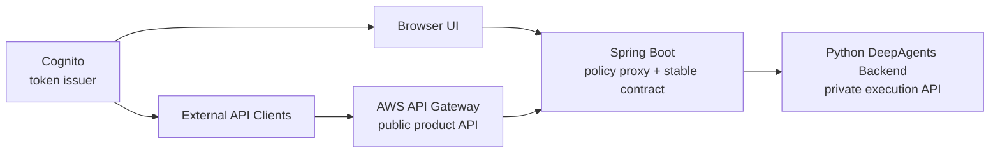
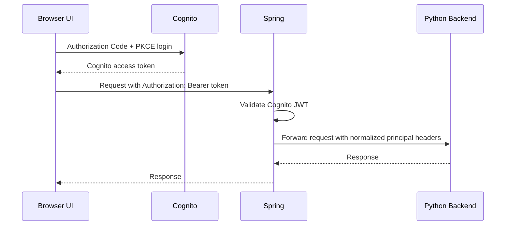
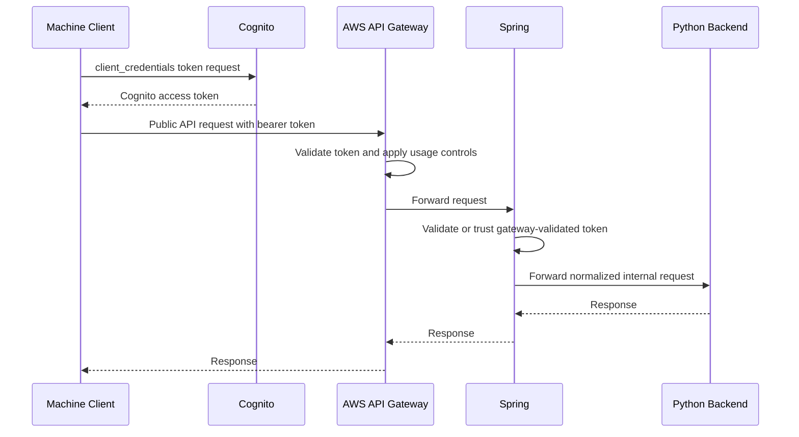
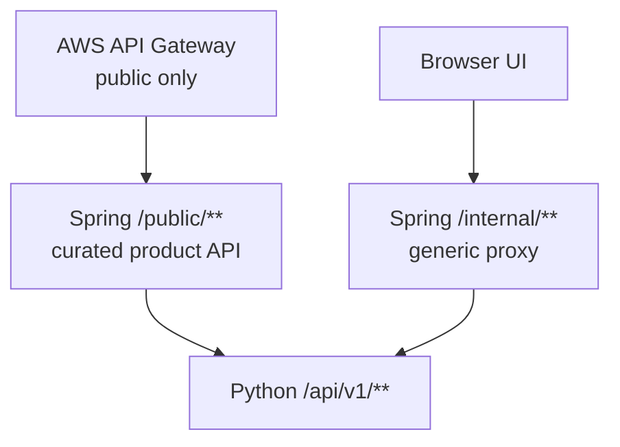
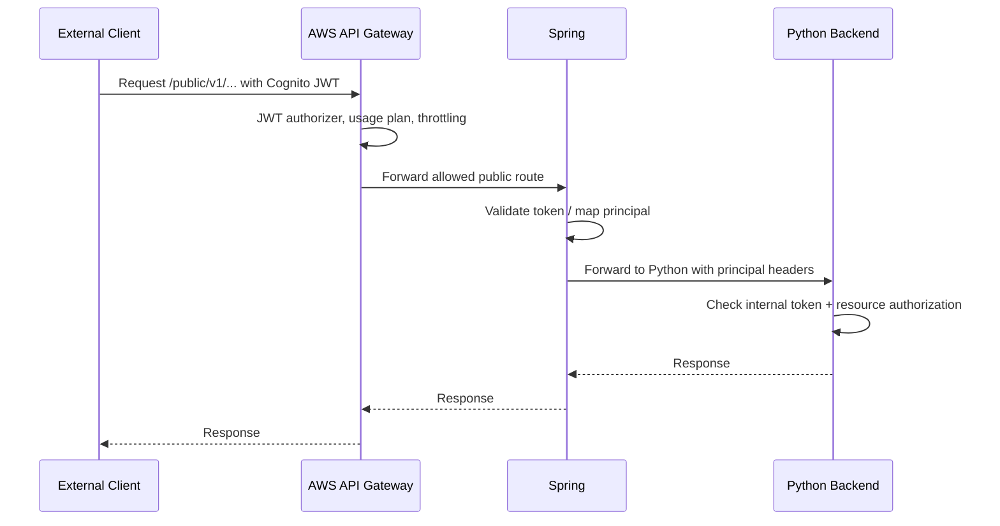
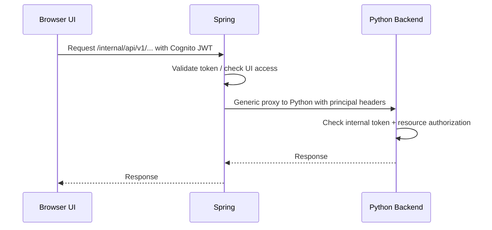

# CODEX Auth and Gateway Architecture

## Purpose

This document summarizes the recommended architecture for exposing DeepAgents through AWS API Gateway, Cognito, Spring Boot, and the Python agent backend.

It builds on `CODEX-5.5-revised-plan.md` and focuses only on ingress, authentication, routing, and trust boundaries.

## Recommendation

Use Cognito as the single API-facing token issuer. Use Spring Boot as the single ingress path to the Python backend. Use AWS API Gateway only for the public external product API surface.

High-level shape:



The Python backend should not be reachable directly from the public internet.

## Core Decisions

1. Cognito issues the tokens that reach AWS API Gateway and Spring.
2. Keycloak should be removed or federated into Cognito if it must remain the login source.
3. AWS API Gateway exposes only the small external public API.
4. Spring remains because it is the stable team-owned contract and proxy boundary.
5. Python owns execution, conversations, turns, runs, and event logs.
6. Spring should not mirror every Python endpoint by hand.
7. Spring should provide a generic authenticated internal proxy for UI/internal API calls.
8. Public external endpoints should be curated and explicit.

## Why Not Two Token Issuers

AWS API Gateway JWT authorizers are simplest when they trust one issuer. If the UI uses Keycloak tokens and external clients use Cognito tokens, every downstream service has to handle two token formats, two JWKS sources, two role mappings, and two sets of claims.

Prefer one of these approaches:

1. Use Cognito for all users and machine clients.
2. Federate Keycloak into Cognito, so users still authenticate with Keycloak but receive Cognito JWTs.

Avoid trying to merge two live tokens. Normalize identity at the issuer or at Spring, not in every backend.

## Preferred Auth Model

### User login



### Programmatic clients



## Keycloak Options

### Option A: Remove Keycloak

Use Cognito User Pools for browser users and machine clients.

This is simplest if there is no hard requirement for Keycloak-specific login flows, theming, or authorization behavior.

```text
Cognito User Pool
  -> UI users: Authorization Code + PKCE
  -> machine clients: Client Credentials
  -> AWS API Gateway: native JWT authorizer
  -> Spring: JWT validation and principal mapping
```

### Option B: Federate Keycloak Into Cognito

Use Keycloak as the login source but Cognito as the token issuer that reaches the API.

```text
UI -> Cognito Hosted UI -> Keycloak login -> Cognito JWT -> API Gateway -> Spring -> Python
```

This keeps AWS API Gateway unchanged and still supports Keycloak-backed login.

Important setup:

- create an OIDC client in Keycloak for Cognito federation
- configure Keycloak as an OIDC identity provider in Cognito
- map required claims into Cognito, especially email and roles/groups
- verify the final Cognito token contains the app roles Spring needs

### Option C: Spring Accepts Both Cognito and Keycloak

Spring can validate multiple issuers, but this is more complex and should be avoided unless required.

Use this only if some clients must send Cognito tokens and others must send Keycloak tokens.

Spring then maps both issuers into the same internal principal shape before forwarding to Python.

## Spring's Role

Spring should be a policy proxy and stable contract boundary, not a duplicated implementation of the Python API.

Spring owns:

- Cognito JWT validation
- coarse role and scope checks
- external route curation
- internal route proxying
- request normalization
- correlation IDs
- audit logging
- forwarding trusted principal headers
- protecting Python from direct public access

Spring should not own:

- agent execution
- conversations, turns, runs, or event storage
- run lifecycle rules
- event-log semantics
- Python endpoint-by-endpoint business logic

## Avoid Endpoint Duplication

If Spring creates one controller method for every Python endpoint, it becomes a bottleneck. Every Python API change would require a Spring change.

Use two route families instead:

```text
/public/**    explicit curated external product API
/internal/**  generic authenticated reverse proxy to Python
```

Architecture:



## Public API Surface

The public API is a product. It should be small, stable, versioned, documented, and rate-limited.

Starting public surface:

```text
POST /public/v1/conversations
POST /public/v1/conversations/{id}/turns
GET  /public/v1/runs/{id}
GET  /public/v1/runs/{id}/events
```

AWS API Gateway should expose only these public routes at first.

Public API concerns:

- Cognito JWT authorizer
- API keys if required by product/commercial model
- usage plans
- throttling
- WAF
- public OpenAPI docs
- backward-compatible versioning

## UI/Internal API Surface

The UI needs a broader surface and can change faster.

Expose it through Spring, not directly through AWS API Gateway:

```text
/internal/api/v1/** -> Python /api/v1/**
```

Spring validates the Cognito token, checks that the caller is allowed to use the UI/internal surface, and forwards the request to Python.

The UI/internal surface can include:

- conversations
- turns
- runs
- run events
- admin views
- future UI-specific reads

Do not expose `/internal/**` publicly through AWS API Gateway.

## Python Backend Trust Boundary

Python should receive traffic only from Spring.

Enforce this through infrastructure first:

- private subnet or private service endpoint
- security group allows inbound only from Spring
- no public load balancer directly to Python

Add an application-level tripwire:

```http
X-Internal-Token: <shared secret known only to Spring and Python>
```

Python rejects requests missing the expected internal token.

This is not the primary security boundary. It is a guardrail that catches misrouting or accidental exposure.

## Principal Header Contract

Spring validates the external token and forwards normalized principal headers to Python.

Recommended headers:

```http
X-Principal-Subject: <stable subject>
X-Principal-Issuer: cognito
X-Principal-Username: <username or email>
X-Principal-Roles: deepagents_user,deepagents_admin
X-Api-Surface: public|internal
X-Request-ID: <correlation id>
X-Internal-Token: <shared internal secret>
```

Python uses these headers to:

- set `owner_subject` on conversations
- authorize conversation reads and writes
- authorize cancel and retry
- restrict admin endpoints
- write audit logs

Python should not trust these headers unless the internal token is valid and network isolation is in place.

## Python Schema Impact

Add owner fields to conversations:

```sql
ALTER TABLE conversations
ADD COLUMN owner_subject TEXT NOT NULL,
ADD COLUMN owner_issuer TEXT NOT NULL DEFAULT 'cognito';
```

Optional audit fields:

```sql
ALTER TABLE runs
ADD COLUMN requested_by_subject TEXT,
ADD COLUMN requested_via_surface TEXT;
```

Keep ownership simple:

- browser users: `owner_subject = Cognito sub`
- machine clients: `owner_subject = Cognito client subject or client_id`

## Authorization Model

Start simple:

| Action | Required rule |
|---|---|
| Create conversation | authenticated principal |
| List conversations | same `owner_subject` |
| Read conversation | same `owner_subject` or admin |
| Create turn | same `owner_subject` or admin |
| Read run/events | same `owner_subject` or admin |
| Cancel/retry run | same `owner_subject` or admin |
| Admin endpoints | `deepagents_admin` role |

Spring can enforce coarse access. Python should still enforce resource ownership because only Python has direct access to conversation/run ownership data.

## External vs Internal Contract

The public external API and UI/internal API have different stability requirements.

| Concern | Public API | UI/Internal API |
|---|---|---|
| Consumers | external customers, integrations | your UI and internal teams |
| Exposure | public internet through API Gateway | internal through Spring |
| Surface | small and deliberate | broader |
| Versioning | strict | flexible |
| Rate limiting | yes | usually no |
| API keys | optional/product-dependent | no |
| Docs | public OpenAPI | internal docs only |
| Change speed | slow | faster |

## Request Flow Summary

### Public external request



### UI/internal request



## Recommended Implementation Steps

1. Decide whether Keycloak is removed or federated into Cognito.
2. Standardize the token that reaches Spring as a Cognito JWT.
3. Define Spring principal mapping from Cognito claims to `X-Principal-*` headers.
4. Add `owner_subject` and `owner_issuer` to the Python schema.
5. Add Python middleware that requires `X-Internal-Token`.
6. Add Python dependency that reads normalized principal headers.
7. Apply ownership checks in Python services.
8. Add Spring `/internal/**` generic proxy to Python.
9. Add Spring `/public/**` curated external routes.
10. Configure AWS API Gateway to expose only `/public/**`.

## Recommended Final Shape

```text
Cognito
  -> UI login and machine tokens

AWS API Gateway
  -> public API only
  -> Cognito authorizer
  -> usage plans and throttling
  -> forwards to Spring /public/**

Spring Boot
  -> validates Cognito tokens
  -> maps principal headers
  -> exposes curated /public/**
  -> exposes generic /internal/**
  -> forwards to Python

Python DeepAgents Backend
  -> private only
  -> verifies internal token
  -> trusts normalized principal headers
  -> enforces resource ownership
  -> owns execution and event log
```

## Open Questions

1. Will Keycloak be removed, or federated into Cognito?
2. Which Cognito claim carries app roles: groups, custom claim, or pre-token-generation Lambda?
3. Is the UI hosted where it can call Spring directly, or must UI traffic also pass through API Gateway/CloudFront?
4. Are API keys required for the public API in addition to Cognito JWTs?
5. Does Spring need to reshape public responses, or can it transparently proxy the curated public endpoints?

## Recommendation

Use Cognito as the single issuer. Keep Spring as the stable team-owned contract and proxy. Do not make Spring mirror every Python endpoint. Expose a small `/public/**` product API through AWS API Gateway and a generic authenticated `/internal/**` proxy for the UI/internal surface.

This keeps the public API controlled, lets the UI move quickly, preserves Spring's organizational role, and avoids duplicating Python endpoint work in Spring.
