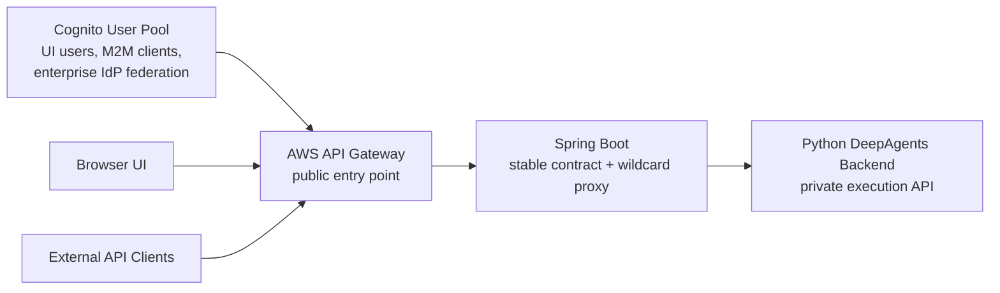
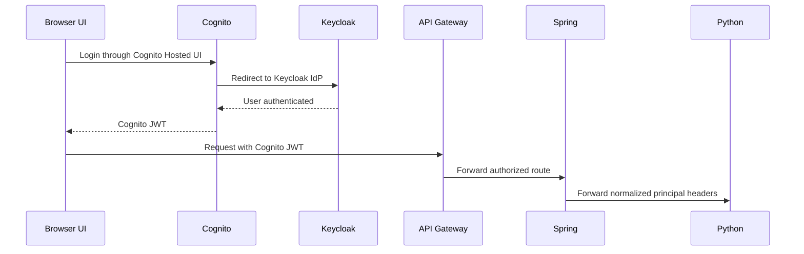
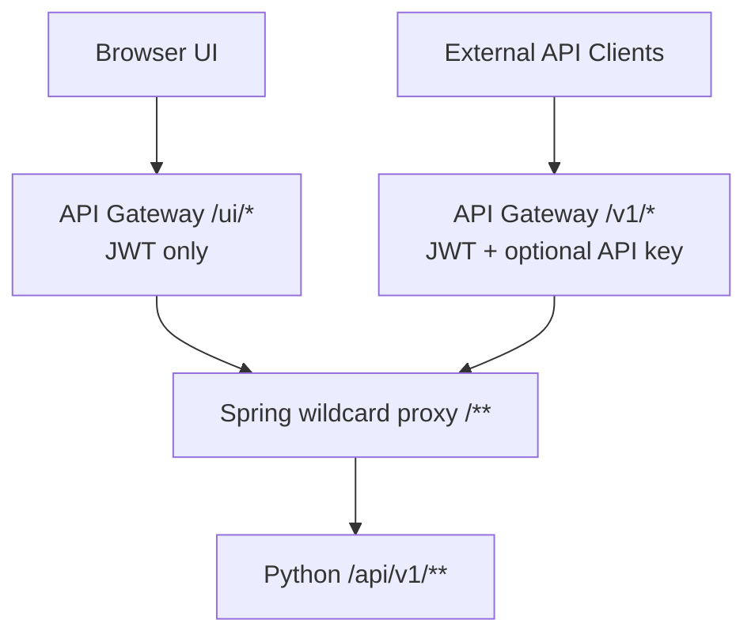
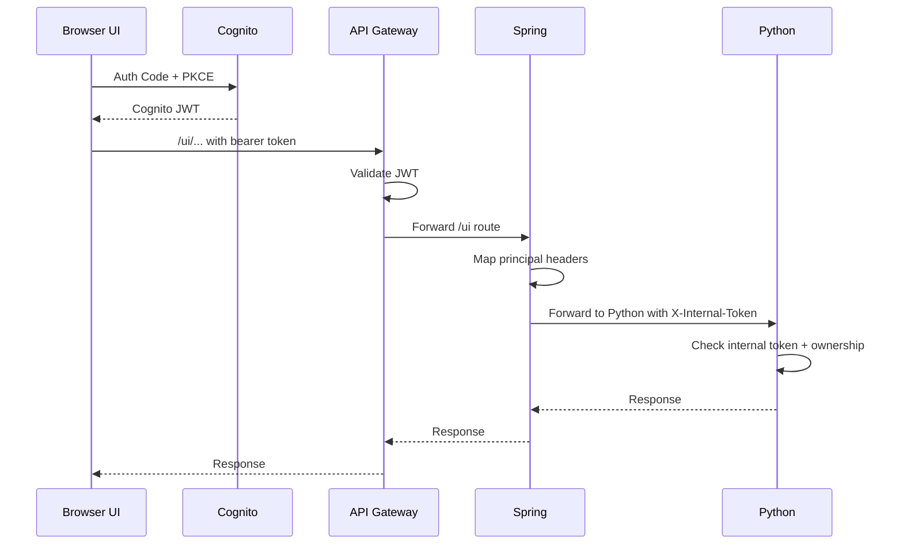
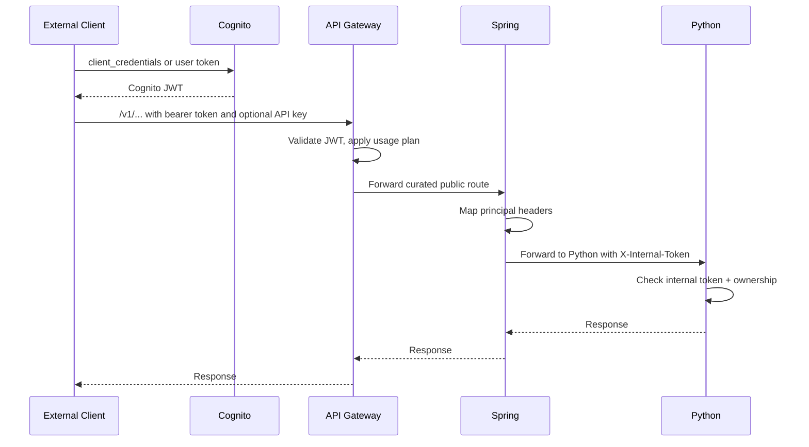

# DeepAgents - Final Consensus Gateway and Auth Architecture

Synthesized from the Claude and Codex gateway/auth plans. This is the canonical reference for ingress, authentication, routing, and trust boundaries.

## TL;DR

- Cognito is the single API-facing identity provider.
- Keycloak should be removed unless there is a hard requirement; if it remains, federate it into Cognito.
- AWS API Gateway is the only public internet entry point.
- API Gateway exposes two route groups: external product API and UI API.
- Spring is kept as the stable team-owned contract and wildcard proxy.
- Spring should not mirror every Python endpoint.
- Python is private and only reachable from Spring.
- Python trusts normalized principal headers only after checking an internal token.
- Python still enforces resource ownership because it owns conversation/run data.

## High-Level Shape



Four roles stay deliberately small:

| Role | Responsibility |
|---|---|
| Cognito | Issues the JWTs for UI users, machine clients, and federated enterprise users. |
| AWS API Gateway | Public entry point, JWT authorizer, API keys, usage plans, throttling, route exposure control. |
| Spring Boot | Stable team-owned proxy contract, principal normalization, internal token forwarding, optional response shaping. |
| Python Backend | Private execution API, conversations, turns, runs, event log, ownership authorization. |

## Core Decisions

1. Use Cognito as the single issuer downstream systems care about.
2. Do not ask Python to understand Keycloak and Cognito tokens.
3. Keep Spring because it is an organizational boundary and stable internal contract.
4. Make Spring a wildcard proxy, not a per-endpoint mirror.
5. Use API Gateway to decide which routes are publicly exposed.
6. Let UI traffic use the larger `/ui/*` API Gateway route group.
7. Let external customers use the smaller `/v1/*` API Gateway route group.
8. Keep Python private and reachable only from Spring.
9. Python verifies `X-Internal-Token` before trusting any principal headers.
10. Python enforces resource ownership using normalized subject claims.

## Why Cognito as the Single Issuer

AWS API Gateway is simplest and most reliable when its JWT authorizer trusts one issuer. Cognito already supports the three required client types:

| Client type | Auth flow | Final token |
|---|---|---|
| Browser UI users | Authorization Code + PKCE | Cognito JWT |
| Machine clients and scripts | Client Credentials | Cognito JWT |
| Enterprise customers with their own IdP | OIDC/SAML federation into Cognito | Cognito JWT |

Everything downstream sees Cognito JWTs. Whether the user originally authenticated with Cognito, Okta, Azure AD, or Keycloak is hidden behind Cognito federation.

## Keycloak Decision

Preferred path:

- remove Keycloak and use Cognito User Pools directly

Fallback path:

- federate Keycloak into Cognito as an OIDC identity provider

Avoid:

- letting the UI send Keycloak tokens while external clients send Cognito tokens
- making Spring and Python validate multiple issuer types unless required

Federated Keycloak flow:



## Route Groups

API Gateway exposes two route families with different policies. Both forward to Spring.



## External API: `/v1/*`

The external API is a product surface. It should be small, stable, versioned, documented, and rate-limited.

Initial public endpoints:

```text
POST /v1/conversations
POST /v1/conversations/{id}/turns
GET  /v1/runs/{id}
GET  /v1/runs/{id}/events
```

Recommended API Gateway policy:

| Concern | Policy |
|---|---|
| Auth | Cognito JWT authorizer |
| API keys | yes if this is a product/commercial API |
| Usage plans | yes |
| Throttling | yes |
| Versioning | strict `/v1` prefix |
| Docs | public OpenAPI |
| Exposure | deliberately curated |

Adding a Python endpoint does not expose it externally. A route must be added to API Gateway intentionally.

## UI API: `/ui/*`

The UI needs a broader surface and can change faster. It should still enter through API Gateway if the UI is internet-facing.

Recommended API Gateway policy:

| Concern | Policy |
|---|---|
| Auth | Cognito JWT authorizer |
| API keys | no |
| Usage plans | no, or broad global limits only |
| Versioning | flexible |
| Docs | internal |
| Exposure | UI-only route group |

The UI route group forwards to Spring, which then forwards to Python.

Example:

```text
UI calls:      GET /ui/api/v1/conversations/123
Spring calls:  GET http://python-backend:8000/api/v1/conversations/123
```

## Spring's Role

Spring exists because other teams treat it as the stable internal contract. That is a valid reason to keep it.

Spring owns:

- stable ingress contract for other teams
- wildcard proxying to Python
- optional response shaping for public endpoints
- correlation IDs
- audit logging
- normalized principal headers
- internal token injection
- coarse route and role checks where useful

Spring should not own:

- agent execution
- conversations, turns, runs, or events
- event-log semantics
- one controller per Python endpoint
- duplicate business logic

## Spring Wildcard Proxy

Spring should have broad forwarding rules, not a mirror of every Python endpoint.

Conceptual Spring route behavior:

```text
/ui/** -> strip /ui prefix -> forward to Python /api/v1/**
/v1/** -> forward curated external routes to Python or reshape when needed
```

If a new Python endpoint is needed for the UI:

```text
Add endpoint to Python
  -> immediately usable through /ui/*
  -> not externally public unless API Gateway exposes it under /v1/*
  -> no Spring endpoint duplication required
```

## Python Trust Boundary

Python is private. It should receive traffic only from Spring.

Primary enforcement:

- private VPC networking
- security groups allow inbound only from Spring
- no public load balancer directly to Python

Application guardrail:

```http
X-Internal-Token: <shared secret>
```

Python rejects requests missing the expected internal token. This is a tripwire for misconfiguration, not the main security boundary.

## Principal Header Contract

Spring forwards normalized identity to Python.

Recommended headers:

```http
X-Principal-Subject: <cognito sub or service account subject>
X-Principal-Issuer: cognito
X-Principal-Username: <username or email>
X-Principal-Roles: deepagents_user,deepagents_admin
X-Api-Surface: external|ui
X-Request-ID: <correlation id>
X-Internal-Token: <shared internal secret>
```

Python uses these headers to:

- set conversation ownership
- authorize reads and writes
- authorize cancel and retry
- restrict admin endpoints
- write audit logs

Python should never trust client-supplied `X-Principal-*` headers from public traffic. It trusts them only after network isolation and `X-Internal-Token` validation.

## Python Schema Impact

Add ownership fields to conversations:

```sql
ALTER TABLE conversations
ADD COLUMN owner_subject TEXT NOT NULL,
ADD COLUMN owner_issuer TEXT NOT NULL DEFAULT 'cognito';
```

Optional audit fields:

```sql
ALTER TABLE runs
ADD COLUMN requested_by_subject TEXT,
ADD COLUMN requested_via_surface TEXT;
```

Owner mapping:

| Caller | `owner_subject` |
|---|---|
| Browser user | Cognito `sub` |
| Machine client | Cognito service account subject or client id |
| Federated enterprise user | Cognito `sub`, with original IdP data mapped into Cognito claims if needed |

## Authorization Model

Start simple:

| Action | Required rule |
|---|---|
| Create conversation | authenticated principal |
| List conversations | same `owner_subject` |
| Read conversation | same `owner_subject` or admin |
| Create turn | same `owner_subject` or admin |
| Read run/events | same `owner_subject` or admin |
| Cancel/retry run | same `owner_subject` or admin |
| Admin endpoints | `deepagents_admin` role |

Spring can enforce broad route access. Python still enforces resource ownership because Python owns the data needed to make that decision.

## Request Flows

### Browser UI request



### External API request



## API Key Model

API keys are for the external product API, not for the UI.

| Surface | API key |
|---|---|
| `/v1/*` external API | yes if product/commercial usage tracking is needed |
| `/ui/*` UI API | no |

Use API Gateway usage plans for:

- external customer rate limits
- usage quotas
- commercial API usage reporting

Do not require the browser UI to carry a shared API key unless there is a specific infrastructure requirement.

## Network Isolation

| Component | Reachable from |
|---|---|
| Cognito | public internet |
| AWS API Gateway | public internet |
| Spring | API Gateway only |
| Python backend | Spring only |

This is the intended trust chain:

```text
Public caller -> API Gateway -> Spring -> Python
```

There should be no valid route:

```text
Public caller -> Python
API Gateway -> Python
```

## Spring vs API Gateway Responsibilities

| Concern | AWS API Gateway | Spring |
|---|---|---|
| Public entry point | yes | no |
| JWT authorizer | yes | can trust gateway or re-check |
| API keys and usage plans | yes | no |
| Public route curation | yes | supports forwarding |
| Stable internal team contract | no | yes |
| Wildcard forwarding to Python | no | yes |
| Principal header normalization | possible | yes |
| Python internal token injection | no | yes |
| Business logic | no | no |

## Implementation Steps

1. Standardize on Cognito JWTs downstream.
2. Remove Keycloak or federate it into Cognito.
3. Configure API Gateway route groups: `/v1/*` and `/ui/*`.
4. Configure `/v1/*` with external policies: JWT, optional API key, usage plan, throttling.
5. Configure `/ui/*` with UI policies: JWT only, no API key.
6. Make both route groups forward to Spring.
7. Configure Spring wildcard proxying to Python.
8. Define and implement `X-Principal-*` header mapping in Spring.
9. Add `X-Internal-Token` injection in Spring.
10. Make Python require `X-Internal-Token`.
11. Add `owner_subject` and `owner_issuer` to Python schema.
12. Enforce ownership and admin role checks in Python services.
13. Add integration tests for public and UI paths.

## Decision Log

| Decision | Choice | Reason |
|---|---|---|
| API-facing IdP | Cognito | Native API Gateway support and one downstream token type |
| Keycloak | remove or federate | Avoid dual-token complexity |
| Public entry | AWS API Gateway | Single public choke point |
| Spring | keep | Stable team-owned contract |
| Spring routing | wildcard proxy | Avoid endpoint duplication |
| Public API | `/v1/*` | Stable external product surface |
| UI API | `/ui/*` | Broader route group for frontend |
| Python exposure | private only | Protect full backend surface |
| Python auth input | normalized headers | Keeps Python decoupled from Cognito SDK/JWT details |
| Python ownership checks | yes | Python owns resource data |

## Open Questions

1. Will Keycloak be removed, or federated into Cognito?
2. Which Cognito claim carries app roles: groups, custom claim, or pre-token-generation Lambda?
3. Does Spring need to reshape public `/v1/*` responses, or can it transparently proxy them?
4. Are API keys required for `/v1/*` from day one?
5. Is the UI hosted behind API Gateway, CloudFront, or another frontend distribution layer?
6. Should Spring re-validate JWTs, or trust API Gateway and only map forwarded claims?

## Recommendation

Use Cognito as the single token issuer. Put both external and UI traffic through AWS API Gateway. Keep Spring as a wildcard proxy and stable team contract. Expose external customers only to curated `/v1/*` routes, expose the UI to broader `/ui/*` routes, and keep Python private behind Spring.

This gives a small controlled public API, a flexible UI API, no duplicated Spring endpoint work, and one clear trust chain from Cognito to API Gateway to Spring to Python.
