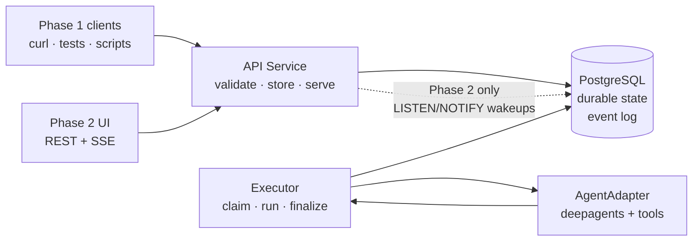
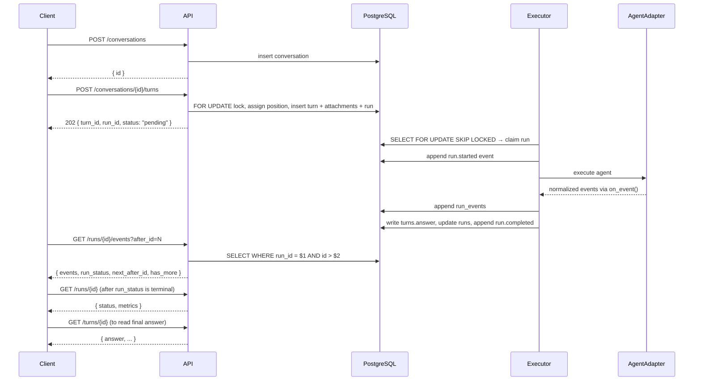
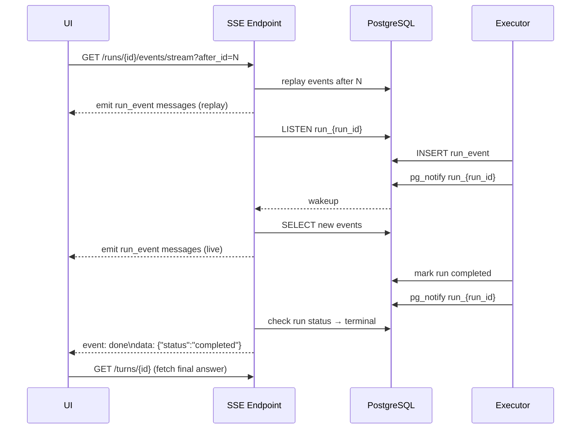
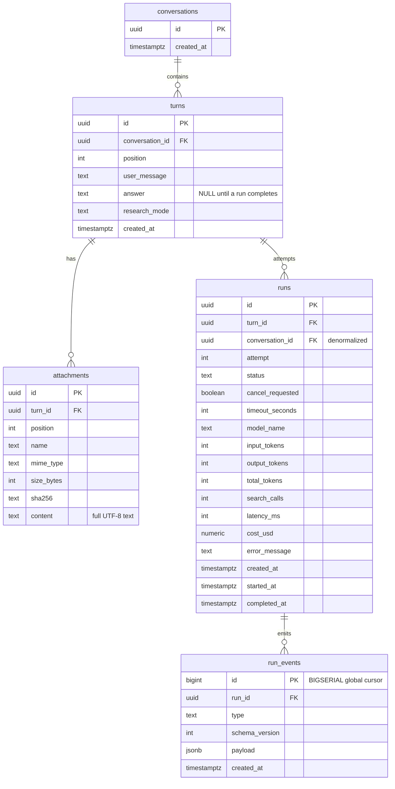
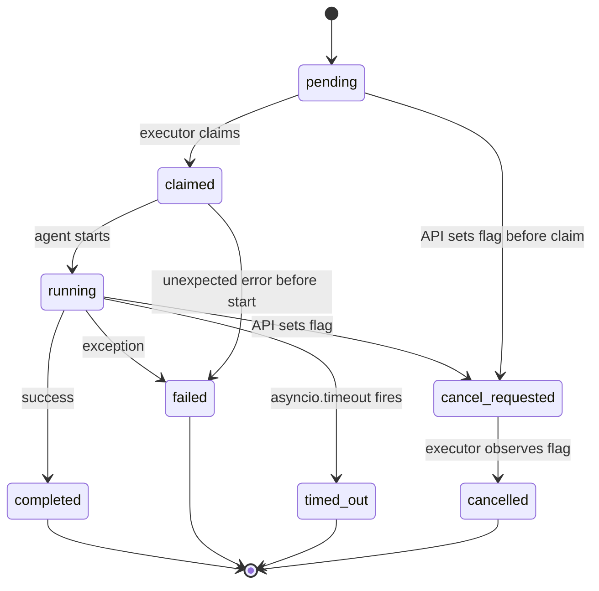

# DeepAgents — Final Consensus Design Plan

*Synthesized from the Claude and Codex revised plans. This is the canonical reference going forward.*

---

## Philosophy

Execution is primary. Delivery is a projection.

A run exists independently of any HTTP connection. The event log is the append-only source of truth. SSE, added in Phase 2, is a streaming read of that log — a new connection replays from cursor 0, a reconnect replays from the last known cursor. The code path is identical. The HTTP layer creates durable intent and serves reads. It never owns execution.

---

## High-Level System Shape



Four roles, deliberately small:

| Role | Responsibility |
|---|---|
| **API service** | Accepts commands, serves reads, validates auth. Phase 2: serves SSE. |
| **Executor** | Claims pending runs, invokes the agent, appends events, finalizes outcomes. |
| **PostgreSQL** | Stores all durable domain state and the event log. Phase 2: wakes SSE via NOTIFY. |
| **Clients** | Phase 1: scripts, tests, curl. Phase 2: web UI. |

---

## Core Principles

1. **Append-only event log is the single source of truth.** No `trace_data` JSON columns. No duplicate event storage. One table: `run_events`.
2. **Turn and Run are separate concepts.** A turn is the user's submission. A run is one execution attempt. Retries create a new run for the same turn.
3. **DB-generated sequence.** `run_events.id` is `BIGSERIAL` — monotonically increasing, DB-assigned. No `max(sequence) + 1` race in application code.
4. **HTTP never owns execution.** Requests enqueue work and read results. The executor writes state.
5. **Cancellation is a DB column.** `runs.cancel_requested BOOLEAN` — multi-process safe, no Redis, no in-memory sets.
6. **Auth from Phase 1.** Static bearer token minimum. No unauthenticated admin endpoints.
7. **Alembic from day one.** `create_all()` does not exist in the production path.
8. **Fail fast on misconfiguration.** Missing secrets abort startup.
9. **One stable event envelope.** Same shape for JSON polling (Phase 1) and SSE streaming (Phase 2).
10. **Phase 1 has no SSE.** Clients poll `GET /runs/{id}/events?after_id=N`. SSE is a Phase 2 upgrade to the same endpoint.

---

## Keep It Simple Rules

These rules govern every implementation decision that has a tempting "more general" path:

1. Build Phase 1 without a frontend.
2. Build Phase 1 without SSE.
3. PostgreSQL is the only coordination dependency.
4. One event table is the trace source of truth.
5. `run_events.id` is the cursor. No application-generated sequence.
6. One active run per conversation in Phase 1.
7. Keep the executor in-process; structure the seam so it can move out later.
8. Prefer explicit SQL read queries over read-model tables.
9. Final answer lives on `turns.answer` — no separate artifacts table in Phase 1.
10. Do not add Redis, Celery, WebSockets, vector memory, or multi-tenant billing in the first pass.

---

## Minimum Viable Phase 1

The smallest useful version:

```
1. create a conversation
2. create a turn
3. create one pending run for that turn
4. execute the run in the background
5. persist typed events to run_events
6. poll events by cursor
7. read final answer after completion
```

Required in the first pass: Alembic schema, fail-fast settings, stub adapter for tests, real adapter, event polling endpoint, startup recovery.

Allowed to defer: SSE, browser UI, generated TypeScript types, distributed worker, lease-based recovery, event batching.

---

## Zoom 1: Request Flow

### Phase 1 — REST + polling



### Phase 2 — SSE stream upgrade



---

## Zoom 2: Domain Model



**The key relationship:** `turns → runs`. The user's submission is stable; execution attempts can be retried. The final answer belongs to the turn, not the run.

**Attachments belong to the turn.** They are part of the user's submission and do not change across retries.

---

## Zoom 3: Run Lifecycle



**`claimed`** bridges the gap between picking up a run and agent start — prevents two workers claiming the same run.

**`cancel_requested`** is set by the API via `runs.cancel_requested = true`. The executor polls this flag cooperatively after each event insert. Correct across process boundaries.

---

## Zoom 4: API Surface

Base path: `/api/v1`

All non-health endpoints require `Authorization: Bearer <token>`.

### Error envelope

```json
{
    "error": "run_not_found",
    "message": "Run abc123 does not exist.",
    "status": 404
}
```

Standard codes: `not_found`, `conflict`, `validation_error`, `unauthorized`, `internal_error`.

---

### Conversations

| Method | Path | Description | Status |
|---|---|---|---|
| `POST` | `/conversations` | Create conversation | `201` |
| `GET` | `/conversations` | List, most-recently-active first, cursor-paginated | `200` |
| `GET` | `/conversations/{id}` | Full detail: turns + latest run summaries (no events) | `200` |

**`GET /conversations` response:**
```json
{
    "conversations": [
        {
            "id": "uuid",
            "title": "Compare the latest US inflation...",
            "preview": "Based on current data...",
            "turn_count": 3,
            "last_turn_at": "2026-05-24T10:01:00Z",
            "active_run": { "id": "uuid", "status": "running" }
        }
    ],
    "next_cursor": null
}
```

`active_run` is non-null when any run for this conversation is `pending`, `claimed`, `running`, or `cancel_requested`. Implemented as a single `SELECT DISTINCT ON (conversation_id)` query — not N+1.

---

### Turns

| Method | Path | Description | Status |
|---|---|---|---|
| `POST` | `/conversations/{id}/turns` | Create turn + enqueue run | `202` |
| `GET` | `/conversations/{id}/turns` | List turns in order | `200` |
| `GET` | `/turns/{id}` | Single turn: all run attempts | `200` |
| `POST` | `/turns/{id}/retry` | Create new run attempt (only when latest run is terminal) | `202` |

**`POST /conversations/{id}/turns` request:**
```json
{
    "message": "Research the latest changes.",
    "research_mode": "standard",
    "attachments": [
        {
            "name": "notes.txt",
            "mime_type": "text/plain",
            "size_bytes": 4821,
            "content": "Full UTF-8 text..."
        }
    ]
}
```

Attachment constraints: max 6, max 200,000 bytes each, max 600,000 bytes total.

**Response `202`:**
```json
{
    "turn_id": "uuid",
    "run_id": "uuid",
    "conversation_id": "uuid",
    "position": 2,
    "status": "pending",
    "research_mode": "standard",
    "created_at": "2026-05-24T10:01:00Z"
}
```

**Side effects (one transaction):**
1. `SELECT ... FOR UPDATE` on conversation — prevents duplicate position assignment
2. Validate no other run in this conversation is non-terminal (`409` if conflict)
3. Assign `position = COALESCE(MAX(position), 0) + 1`
4. Insert turn + attachments + run (`status = 'pending'`)
5. Commit, then signal executor

---

### Runs

| Method | Path | Description | Status |
|---|---|---|---|
| `GET` | `/runs/{id}` | Run status, metrics, error | `200` |
| `POST` | `/runs/{id}/cancel` | Request cooperative cancellation | `200` |
| `GET` | `/runs/{id}/events` | Cursor-paginated event log (Phase 1 polling) | `200` |
| `GET` | `/runs/{id}/events/stream` | SSE stream (Phase 2 only) | `200` |

**`GET /runs/{id}/events?after_id=0&limit=100` response:**
```json
{
    "events": [
        {
            "id": 143,
            "run_id": "uuid",
            "type": "search_call",
            "schema_version": 1,
            "payload": { "query": "US CPI June 2026" },
            "created_at": "2026-05-24T10:01:05Z"
        }
    ],
    "run_status": "running",
    "next_after_id": 143,
    "has_more": false
}
```

Polling behavior: poll every 1–2 seconds while active; stop when `run_status` is terminal and `has_more` is false.

---

### Admin

| Method | Path | Description |
|---|---|---|
| `GET` | `/admin/overview` | Aggregate metrics: conversations, turns, runs, tokens, cost |
| `GET` | `/admin/runs` | Recent runs with status, answer preview, full metrics |
| `GET` | `/admin/executor` | Executor health: pending count, oldest pending age, running count |

---

## Zoom 5: Event Model

### Envelope

Every persisted event and every streamed event uses the same shape:

```json
{
    "id": 143,
    "run_id": "uuid",
    "type": "search_call",
    "schema_version": 1,
    "payload": {},
    "created_at": "2026-05-24T10:01:05Z"
}
```

`id` is the `BIGSERIAL` primary key — it is the stable cursor for polling and SSE replay.

### Event types

**Agent progress**

| Type | Phase | Payload |
|---|---|---|
| `thinking` | 1 | `{ "content": "Found 4 sources — now cross-checking." }` |
| `thinking_delta` | 2 | `{ "content": "...incremental chunk..." }` |

The executor accumulates intermediate reasoning and emits one `thinking` event per reasoning segment. Phase 2 may add `thinking_delta` for incremental token-level streaming using the same envelope.

**Tool lifecycle**

| Type | Phase | Key payload fields |
|---|---|---|
| `search_call` | 1 | `query`, `topic`, `max_results` |
| `search_result` | 1 | `query`, `results: [{title, url, snippet}]` |
| `tool_error` | 1 | `tool_name`, `message` |

**Run lifecycle** (emitted by executor)

| Type | When |
|---|---|
| `run.started` | Executor transitions to `running` |
| `run.completed` | Run finishes successfully |
| `run.failed` | Unhandled exception |
| `run.cancelled` | Executor observes `cancel_requested` |
| `run.timed_out` | `asyncio.timeout` fires |

**The final answer is not a stream event.** It is written to `turns.answer` when a run completes. Clients fetch it from `GET /turns/{id}` after the stream closes. This eliminates the `final` event ambiguity from the current implementation.

---

## Zoom 6: Implementation Details

### Database schema

```sql
CREATE TABLE conversations (
    id         UUID        PRIMARY KEY DEFAULT gen_random_uuid(),
    created_at TIMESTAMPTZ NOT NULL DEFAULT now()
);

CREATE TABLE turns (
    id              UUID        PRIMARY KEY DEFAULT gen_random_uuid(),
    conversation_id UUID        NOT NULL REFERENCES conversations(id),
    position        INTEGER     NOT NULL,
    user_message    TEXT        NOT NULL,
    answer          TEXT,                   -- NULL until a run completes
    research_mode   TEXT        NOT NULL,
    created_at      TIMESTAMPTZ NOT NULL DEFAULT now(),
    UNIQUE (conversation_id, position)
);

CREATE TABLE attachments (
    id         UUID        PRIMARY KEY DEFAULT gen_random_uuid(),
    turn_id    UUID        NOT NULL REFERENCES turns(id),
    position   INTEGER     NOT NULL,
    name       TEXT        NOT NULL,
    mime_type  TEXT        NOT NULL,
    size_bytes INTEGER     NOT NULL,
    sha256     TEXT        NOT NULL,
    content    TEXT        NOT NULL,
    created_at TIMESTAMPTZ NOT NULL DEFAULT now(),
    UNIQUE (turn_id, position)
);

CREATE TABLE runs (
    id               UUID          PRIMARY KEY DEFAULT gen_random_uuid(),
    turn_id          UUID          NOT NULL REFERENCES turns(id),
    conversation_id  UUID          NOT NULL REFERENCES conversations(id),
    attempt          INTEGER       NOT NULL DEFAULT 1,
    status           TEXT          NOT NULL DEFAULT 'pending',
    research_mode    TEXT          NOT NULL DEFAULT 'standard',
    model_name       TEXT,
    input_tokens     INTEGER       NOT NULL DEFAULT 0,
    output_tokens    INTEGER       NOT NULL DEFAULT 0,
    total_tokens     INTEGER       NOT NULL DEFAULT 0,
    search_calls     INTEGER       NOT NULL DEFAULT 0,
    latency_ms       INTEGER,
    cost_usd         NUMERIC(12,8) NOT NULL DEFAULT 0,
    error_message    TEXT,
    cancel_requested BOOLEAN       NOT NULL DEFAULT false,
    timeout_seconds  INTEGER       NOT NULL DEFAULT 600,
    created_at       TIMESTAMPTZ   NOT NULL DEFAULT now(),
    started_at       TIMESTAMPTZ,
    completed_at     TIMESTAMPTZ,
    UNIQUE (turn_id, attempt)
);

CREATE INDEX idx_runs_status ON runs(status) WHERE status IN ('pending', 'running', 'claimed');
CREATE INDEX idx_runs_conversation_id ON runs(conversation_id);

CREATE TABLE run_events (
    id             BIGSERIAL    PRIMARY KEY,   -- global monotonic cursor
    run_id         UUID         NOT NULL REFERENCES runs(id),
    type           TEXT         NOT NULL,
    schema_version INTEGER      NOT NULL DEFAULT 1,
    payload        JSONB        NOT NULL DEFAULT '{}',
    created_at     TIMESTAMPTZ  NOT NULL DEFAULT now()
);

CREATE INDEX idx_run_events_run_id_id ON run_events(run_id, id);
```

Pagination query for events is always:
```sql
SELECT * FROM run_events WHERE run_id = $1 AND id > $2 ORDER BY id LIMIT $3
```

---

### Executor claiming

```sql
SELECT id FROM runs
WHERE status = 'pending'
ORDER BY created_at ASC
LIMIT 1
FOR UPDATE SKIP LOCKED;
```

After claiming, update atomically:
```sql
UPDATE runs SET status = 'claimed', started_at = now() WHERE id = $1 AND status = 'pending';
```

---

### Executor lifecycle

```python
async def execute_run(run_id: str, adapter: AgentAdapter) -> None:
    # 1. Claim atomically
    async with session_factory() as session:
        run = await session.get(Run, run_id)
        if not run or run.status != "pending":
            return
        if run.cancel_requested:
            run.status = "cancelled"
            run.completed_at = now()
            await session.commit()
            return
        run.status = "claimed"
        run.started_at = now()
        await session.commit()

    await persist_event(run_id, "run.started", {"research_mode": run.research_mode})

    # 2. Load context
    turn = await load_turn(run.turn_id)
    history = await load_history(run.conversation_id, before_position=turn.position)
    attachments = await load_attachments(run.turn_id)

    async with session_factory() as session:
        (await session.get(Run, run_id)).status = "running"
        await session.commit()

    # 3. Execute with timeout
    started = perf_counter()
    try:
        async with asyncio.timeout(run.timeout_seconds):
            result = await adapter.run(
                user_message=turn.user_message,
                attachments=attachments,
                history=history,
                research_mode=run.research_mode,
                on_event=lambda e: persist_and_notify(run_id, e),
            )
        latency_ms = int((perf_counter() - started) * 1000)

        async with session_factory() as session:
            run = await session.get(Run, run_id)
            turn = await session.get(Turn, run.turn_id)
            if run.cancel_requested:
                run.status = "cancelled"
            else:
                run.status = "completed"
                turn.answer = result.answer
            run.model_name = result.model_name
            run.input_tokens = result.input_tokens      # summed across ALL calls
            run.output_tokens = result.output_tokens
            run.total_tokens = result.total_tokens
            run.search_calls = result.search_calls      # from SearchCallEvent count only
            run.latency_ms = latency_ms
            run.cost_usd = estimate_cost(result.model_name, result.input_tokens, result.output_tokens)
            run.completed_at = now()
            await session.commit()

        await persist_event(run_id, "run.completed", {"latency_ms": latency_ms})

    except asyncio.TimeoutError:
        await _mark_terminal(run_id, "timed_out", f"Exceeded {run.timeout_seconds}s")
        await persist_event(run_id, "run.timed_out", {"timeout_seconds": run.timeout_seconds})

    except asyncio.CancelledError:
        await _mark_terminal(run_id, "cancelled", "Task cancelled.")
        await persist_event(run_id, "run.cancelled", {})
        raise

    except Exception as exc:
        await _mark_terminal(run_id, "failed", str(exc))
        await persist_event(run_id, "run.failed", {"error": str(exc)})
```

**Cooperative cancellation:** `persist_and_notify` checks `runs.cancel_requested` before every event insert. If true, raises `asyncio.CancelledError`. Any process that sets the flag will stop execution at the next event boundary.

```python
async def persist_and_notify(run_id: str, event: AgentEvent) -> None:
    event_type, payload = serialize_event(event)
    async with session_factory() as session:
        run = await session.get(Run, run_id)
        if run and run.cancel_requested:
            raise asyncio.CancelledError()
        session.add(RunEvent(run_id=run_id, type=event_type, payload=payload))
        await session.commit()
        await session.execute(text(f"SELECT pg_notify('run_{run_id}', '')"))
        await session.commit()
```

---

### AgentAdapter interface

The `deepagents` library is isolated behind one adapter. Nothing outside the adapter sees LangChain tuple shapes, stream modes, or message-role conventions.

```python
@dataclass
class SearchResult:
    title: str
    url: str
    snippet: str

@dataclass
class ThinkingEvent:
    content: str

@dataclass
class ThinkingDeltaEvent:  # Phase 2 only
    content: str

@dataclass
class SearchCallEvent:
    query: str
    topic: str = "general"
    max_results: int = 5

@dataclass
class SearchResultEvent:
    query: str
    results: list[SearchResult]

@dataclass
class ToolErrorEvent:
    tool_name: str
    message: str

AgentEvent = ThinkingEvent | ThinkingDeltaEvent | SearchCallEvent | SearchResultEvent | ToolErrorEvent

@dataclass
class RunResult:
    answer: str
    model_name: str
    input_tokens: int   # summed across ALL LLM calls in the run
    output_tokens: int
    total_tokens: int
    search_calls: int   # counted from SearchCallEvent instances only

class AgentAdapter(Protocol):
    async def run(
        self,
        user_message: str,
        attachments: list[Attachment],
        history: list[HistoryTurn],
        research_mode: ResearchMode,
        on_event: Callable[[AgentEvent], Awaitable[None]],
    ) -> RunResult: ...
```

`HistoryTurn` is `(user_message: str, answer: str, attachments: list[Attachment])`. The executor loads history from DB and passes it in. The adapter builds the prompt. Input token counts must be aggregated across all LLM calls in the run — not read only from the final message (this is a known bug in the current implementation).

---

### SSE stream (Phase 2)

```python
@router.get("/runs/{run_id}/events/stream")
async def run_event_stream(run_id: str, after_id: int = 0):
    return StreamingResponse(
        _stream(run_id, after_id),
        media_type="text/event-stream",
        headers={"Cache-Control": "no-cache", "X-Accel-Buffering": "no"},
    )

async def _stream(run_id: str, after_id: int):
    # 1. Replay history
    last_id = after_id
    for event in await event_repo.list(run_id, after_id=last_id):
        yield _sse(event)
        last_id = event.id

    # 2. Already terminal?
    run = await run_repo.get(run_id)
    if run.status in ("completed", "failed", "cancelled", "timed_out"):
        yield f"event: done\ndata: {json.dumps({'status': run.status})}\n\n"
        return

    # 3. Tail via LISTEN/NOTIFY
    async with pg_listen(f"run_{run_id}") as notifications:
        while True:
            try:
                await asyncio.wait_for(notifications.get(), timeout=30)
            except asyncio.TimeoutError:
                yield ": keepalive\n\n"
                continue

            for event in await event_repo.list(run_id, after_id=last_id):
                yield _sse(event)
                last_id = event.id

            run = await run_repo.get(run_id)
            if run.status in ("completed", "failed", "cancelled", "timed_out"):
                yield f"event: done\ndata: {json.dumps({'status': run.status})}\n\n"
                return

def _sse(event: RunEvent) -> str:
    return (
        f"id: {event.id}\n"
        f"event: run_event\n"
        f"data: {json.dumps(event.dict())}\n\n"
    )
```

The `id:` field on each SSE message enables native `EventSource` reconnection via `Last-Event-ID`. Notifications are wakeups only — the SSE handler always reads from the DB before emitting.

---

### Frontend hooks (Phase 2)

```typescript
// No polling — refresh on navigation and after turn creation only
function useConversationList(): { conversations, isLoading, refresh }

// Fetched once on mount, no polling
function useConversation(id: string): { conversation, isLoading }

// Refetched after stream closes to get final answer
function useTurn(id: string): { turn, isLoading, refetch }

// Connects to SSE, accumulates events
function useEventStream(runId: string | null): {
    events: RunEvent[],
    status: 'idle' | 'connecting' | 'streaming' | 'done' | 'error',
}
```

```typescript
function useEventStream(runId: string | null) {
    const [events, setEvents] = useState<RunEvent[]>([])
    const [status, setStatus] = useState<StreamStatus>('idle')

    useEffect(() => {
        if (!runId) return
        setStatus('connecting')
        const source = new EventSource(`/api/v1/runs/${runId}/events/stream`)

        source.addEventListener('run_event', (e) => {
            setEvents(prev => [...prev, JSON.parse(e.data) as RunEvent])
            setStatus('streaming')
        })
        source.addEventListener('done', (e) => {
            const { status } = JSON.parse(e.data)
            setStatus(status === 'completed' ? 'done' : 'error')
            source.close()
        })
        source.onerror = () => { setStatus('error'); source.close() }
        return () => source.close()
    }, [runId])

    return { events, status }
}
```

**Turn lifecycle in the UI:**
```
POST /conversations/{id}/turns
  → { turn_id, run_id, status: "pending" }
  → activate useEventStream(run_id)
  → render EventTimeline as events arrive
  → on "done" event → useTurn(turn_id).refetch() → render turn.answer
  → refresh useConversationList()
```

**Zero interval timers.** The sidebar refreshes only after: (a) creating a conversation, (b) creating a turn, (c) receiving the `done` SSE event. No `setInterval` anywhere.

**Event rendering is by type, not content:**

| Event type | UI element |
|---|---|
| `run.started` | Status badge: Running |
| `thinking` | Collapsible reasoning block |
| `thinking_delta` | Incremental text appended to open block |
| `search_call` | Search query chip |
| `search_result` | Expandable result list |
| `tool_error` | Error callout |
| `run.completed` | Status badge: Done |
| `run.failed` | Error banner |
| `run.cancelled` | Status badge: Cancelled |
| `run.timed_out` | Error banner with timeout info |
| Unknown type | Generic fallback tile |

---

## Module Layout

```
backend/
  src/
    app/
      api/
        routes/
          conversations.py   -- HTTP only: parse, validate, delegate, respond
          turns.py
          runs.py
          admin.py
        auth.py              -- bearer token middleware
        deps.py
        errors.py
      core/
        config.py            -- pydantic-settings, fail-fast on missing secrets
        db.py                -- async engine, session factory
        pricing.py           -- model → cost table
        logging.py           -- structured logging setup
      models/
        conversation.py
        turn.py
        attachment.py
        run.py
        run_event.py
      repositories/          -- SQL queries only, no business logic
        conversation_repo.py
        turn_repo.py
        run_repo.py
        event_repo.py
        attachment_repo.py
      services/              -- orchestration, lifecycle rules
        turn_service.py      -- create turn + run, enforce constraints, load history
        run_service.py       -- cancel, retry, status reads
        executor_service.py  -- claim → run → finalize worker loop
        agent_adapter.py     -- ALL deepagents/LangChain internals contained here
      schemas/               -- Pydantic request/response models (also the OpenAPI contract)
        conversations.py
        turns.py
        runs.py
        events.py
        admin.py
      main.py
  alembic/
    env.py
    versions/
      0001_initial_schema.py
  tests/
    unit/
    integration/
    fixtures/

frontend/                    -- Phase 2 only
  src/
    lib/
      api-types.ts           -- generated from OpenAPI, not hand-maintained
      api.ts                 -- fetch wrappers with runtime validation
    hooks/
      useConversationList.ts
      useConversation.ts
      useTurn.ts
      useEventStream.ts      -- native EventSource, no custom SSE parser
    pages/
      ConversationPage.tsx
      AdminPage.tsx
    components/
      Sidebar.tsx
      TurnList.tsx
      TurnItem.tsx
      LiveTurnView.tsx
      EventTimeline.tsx
      MessageComposer.tsx
      AttachmentPicker.tsx
```

**Separation rules:**
- Routes own HTTP details only.
- Repositories own SQL queries only.
- Services own orchestration and lifecycle rules.
- AgentAdapter owns all external library behavior.

---

## Configuration

```python
class Settings(BaseSettings):
    database_url: str
    api_secret_key: str = Field(min_length=16)       # aborts startup if absent
    admin_secret_key: str = Field(min_length=16)      # aborts startup if absent
    openai_api_key: str = Field(min_length=1)         # aborts startup if absent
    tavily_api_key: str = Field(min_length=1)         # aborts startup if absent
    agent_model: str = "openai:gpt-5-nano"
    agent_max_search_results: int = Field(default=5, ge=1, le=20)
    agent_timeout_light_seconds: int = Field(default=120, ge=30, le=600)
    agent_timeout_standard_seconds: int = Field(default=600, ge=60, le=1800)
    cors_origins: list[str] = Field(default_factory=lambda: ["http://localhost:5173"])
```

---

## Startup Recovery

On startup, mark all `claimed` or `running` runs as failed. Logged so operators see when recovery occurs.

```python
async def recover_stuck_runs() -> None:
    async with session_factory() as session:
        result = await session.execute(
            select(Run).where(Run.status.in_(["claimed", "running"]))
        )
        for run in result.scalars():
            run.status = "failed"
            run.error_message = "Server restarted during execution."
            run.completed_at = now()
        await session.commit()
```

Phase 1 simplification: mark all active non-terminal runs failed on startup. Lease-based recovery (claim stale runs after lease expires) is a Phase 1C hardening item.

---

## Phase Breakdown

### Phase 1A — Schema and foundation
- New database schema (4 tables + indexes)
- Alembic migration 0001
- SQLAlchemy models
- Repository layer (no business logic)
- `pydantic-settings` with fail-fast validation
- Health endpoint

*Acceptance: app boots only with valid required config; migration creates schema from empty DB; tests run against clean test DB.*

### Phase 1B — API execution
- All endpoints: conversations, turns, runs, events (JSON polling), admin
- Executor: claim → run → finalize lifecycle
- AgentAdapter stub for tests, real adapter integration
- Startup recovery
- Bearer token auth
- Integration tests: full turn lifecycle, cancellation, retry, event cursor replay

*Acceptance: run completes with no UI; events queryable by cursor; final answer on turn.*

### Phase 1C — Hardening
- Structured logging with correlation IDs (`X-Request-ID`, run IDs propagated)
- Metrics instrumentation (counters, histograms — see Observability)
- Data retention cleanup job
- Failure tests: executor crash recovery, duplicate claim prevention, malformed adapter stream
- Load test: concurrent runs, event throughput

### Phase 2A — SSE stream
- `GET /runs/{id}/events/stream` with PostgreSQL LISTEN/NOTIFY
- Keepalive comments (30s interval)
- Terminal `done` event
- Reconnect replays from `after_id` with no duplicates

*Acceptance: stream replays history; tails live events; closes on terminal; disconnect does not affect execution.*

### Phase 2B — Minimal UI
- `npx openapi-typescript` generating `api-types.ts` in build
- Runtime API response validation at fetch boundaries
- Conversation list, conversation detail, turn rendering
- `useEventStream` with native `EventSource`
- `EventTimeline` component rendering by event type
- `MessageComposer` with attachment picker
- Cancel and retry controls
- Admin dashboard

---

## Testing Strategy

### Unit tests
- Run status transition logic (all valid/invalid transitions)
- Attachment validation (size, extension, total byte limit)
- Event serialization / deserialization
- Token and cost aggregation (multiple calls → correct total)
- Pricing normalization (model name variants)

### Integration tests
- Create conversation → create turn → run completes → answer on turn
- `GET /events` returns ordered events matching what executor wrote
- Cancel mid-run → status transitions correctly → events include `run.cancelled`
- Retry failed run → new attempt created → second attempt succeeds
- Startup recovery → stuck `running` run marked `failed`
- Concurrent turn creation in same conversation → exactly one succeeds, one gets `409`

### Phase 2 UI tests
- Render completed conversation from REST only (no SSE needed)
- Attach to in-progress run via SSE → events accumulate → `done` → answer appears
- Reconnect with `after_id` → no duplicates
- Cancel from UI → run transitions to `cancelled` → stream closes

---

## Observability

### Structured logging

Every run transition logs: `conversation_id`, `turn_id`, `run_id`, `attempt`, `status`, `latency_ms`.

Every request logs: `method`, `path`, `status_code`, `duration_ms`, `run_id` if applicable.

### Metrics targets

- `runs_created_total` (by research_mode)
- `runs_completed_total` / `runs_failed_total` / `runs_cancelled_total` / `runs_timed_out_total`
- `run_duration_seconds` histogram (by research_mode)
- `run_queue_depth` gauge
- `tokens_used_total` (by model)
- `search_calls_total`
- `event_append_duration_seconds` histogram
- `sse_connections_active` gauge (Phase 2)

---

## Migration Reference

| Current | New |
|---|---|
| `AgentRun` | `runs` |
| `Message` (user row) | `turns.user_message` |
| `Message` (assistant row) | `turns.answer` |
| `MessageAttachment` | `attachments` (references `turn_id`, not `message_id`) |
| `TraceEvent` | `run_events` (references `run_id`) |
| `AgentRun.trace_data` | deleted |
| `BackgroundAgentRunner` | `ExecutorService` (no subscriber queues, no in-memory broadcast) |
| `MetricsService` (god object) | `TurnService` + `RunService` + repositories |

Migration script: for each `AgentRun`, create a turn (from preceding user `Message`), a run (from `AgentRun` fields), copy `TraceEvent` rows to `run_events`, set `turns.answer` from the following assistant `Message`. One-time, runs offline.

---

## Success Criteria

The rewrite is done when:

1. A run completes correctly with no browser connected.
2. SSE can attach, detach, and reattach without affecting execution.
3. No duplicate trace storage exists anywhere.
4. Final answer and full metrics are derivable from persisted state alone.
5. Phase 2 UI has zero event-merging heuristics or content-based type guessing.
6. The executor can be replaced (in-process task → queue worker) without API changes.
7. Full Phase 1 workflow is covered by integration tests with no browser.

---

## Out of Scope

- Multi-user / multi-tenant — single operator deployment.
- Rate limiting — reverse proxy layer.
- Binary attachment upload — text only, inline in request body.
- Turn editing or branching — linear conversation, append-only.
- Dynamic pricing — hardcoded table.
- Vector memory / long-term retrieval.
- Redis, Celery, WebSockets.
